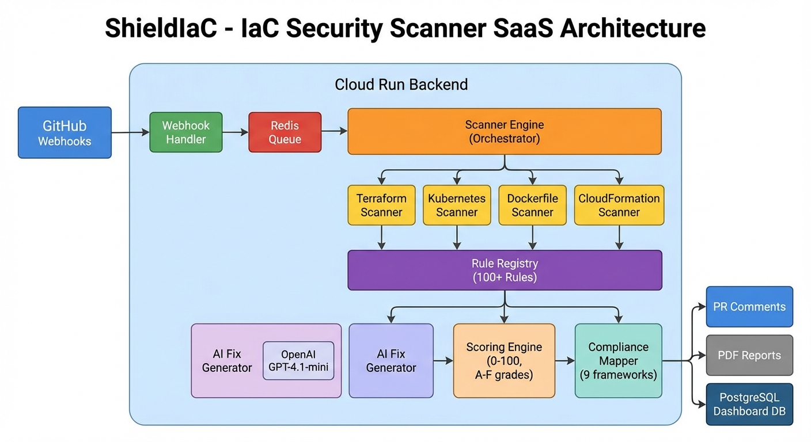
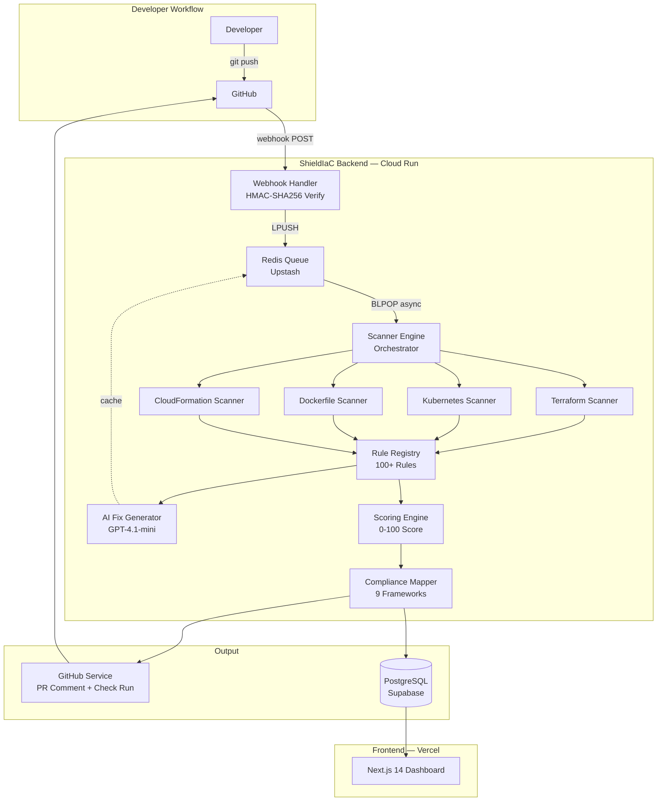
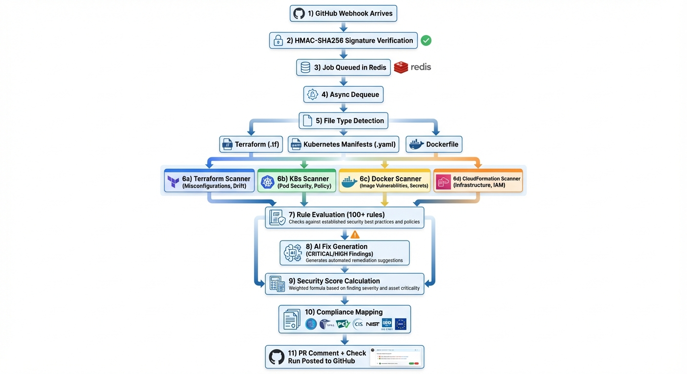
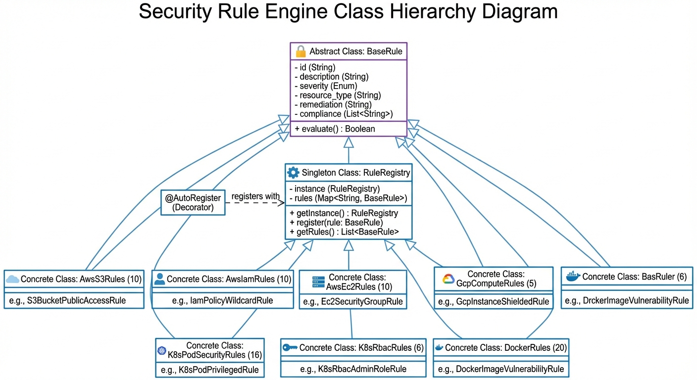
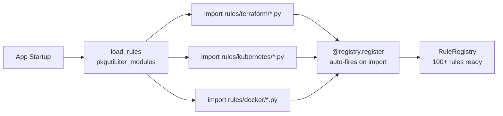
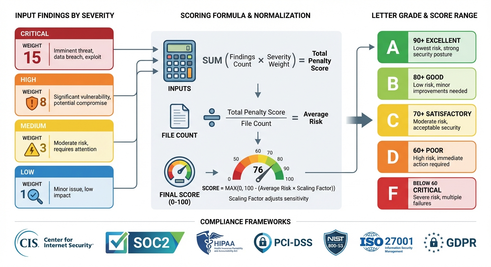
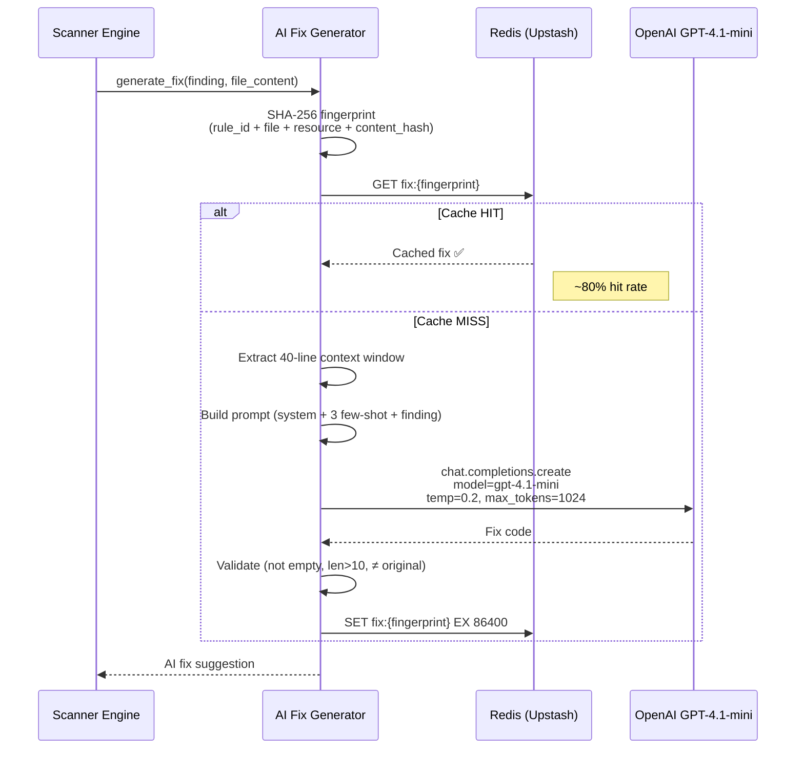
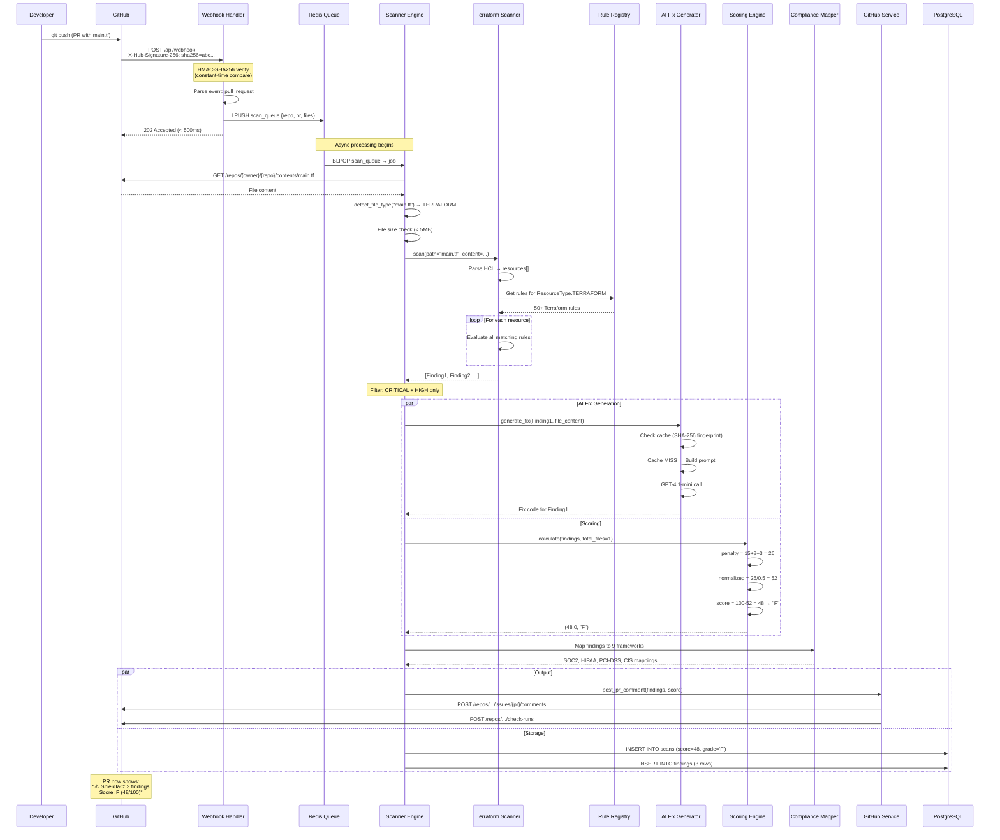
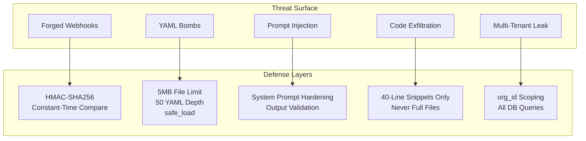

# 🛡️ ShieldIaC — Interview Preparation Guide

> **Complete technical deep-dive and interview Q&A for the ShieldIaC IaC Security Scanner SaaS**
> Target role: DevOps / MLOps / Platform Engineer

---

## 1. Project Overview — The 30-Second Pitch

**ShieldIaC** is a **SaaS Infrastructure-as-Code security scanner** that catches security misconfigurations in Terraform, Kubernetes manifests, Dockerfiles, and CloudFormation templates — **before they reach production**.

### The Elevator Pitch

> "I built ShieldIaC, an IaC security scanner that integrates directly into the PR workflow. When a developer pushes a Terraform file that opens SSH to the world, or a Kubernetes manifest running a container as root, ShieldIaC automatically scans it against 100+ security rules, generates AI-powered fix suggestions using GPT-4.1-mini, calculates a security score from 0-100, and maps every finding to 9 compliance frameworks — SOC2, HIPAA, PCI-DSS, NIST, CIS, ISO-27001, and GDPR. It's the DevSecOps shift-left tool that turns your pull request into a security gate."

### Why This Matters — DevSecOps Shift-Left

| Traditional Security | ShieldIaC (Shift-Left) |
|---------------------|----------------------|
| Security review after deployment | Security scan at PR time |
| Manual audit every quarter | Automated on every push |
| Findings discovered in production | Findings caught before merge |
| "Security is someone else's job" | Security is embedded in developer workflow |
| Compliance reports take weeks | Real-time compliance dashboards |

### Key Numbers

| Metric | Value |
|--------|-------|
| **Security Rules** | 100+ (Terraform 50+, K8s 25+, Docker 20, CF 10+) |
| **Compliance Frameworks** | 9 (CIS AWS/GCP/K8S, SOC2, HIPAA, PCI-DSS, NIST, ISO-27001, GDPR) |
| **AI Model** | GPT-4.1-mini with 24hr Redis cache (~$0.006/scan) |
| **Scoring** | 0-100 weighted score with A-F grades |
| **Scan Time** | < 30s for 100 files |
| **Infrastructure Cost** | ~$45-90/month production |

---

## 2. Architecture Deep-Dive

> 📐 **Reference diagram:** 

### Tech Stack Overview

| Layer | Technology | Why This Choice |
|-------|-----------|----------------|
| **Backend API** | Python / FastAPI on Cloud Run | Async-native, auto-scaling to zero, type-safe with Pydantic |
| **Frontend** | Next.js 14 on Vercel | React Server Components, edge deployment, instant previews |
| **Database** | PostgreSQL (Supabase) | ACID transactions, JSONB for flexible rule metadata, managed |
| **Queue / Cache** | Redis (Upstash) | BLPOP for reliable job queue + 24hr AI fix cache, serverless |
| **AI Engine** | OpenAI GPT-4.1-mini | Best cost/quality ratio for code generation (~$0.002/fix) |
| **Auth** | Clerk | GitHub OAuth native, org-level RBAC, webhook-friendly |
| **Billing** | Stripe Billing | Subscription management with metered usage |
| **DNS / CDN** | Cloudflare | WAF + DDoS protection, free tier |

### High-Level Architecture (Mermaid)



### Why Queue-Based Architecture?

The webhook handler returns **202 Accepted** in under 500ms and pushes the scan job to Redis. This decoupling is critical because:

1. **GitHub has a 10-second webhook timeout** — synchronous scanning would fail for large repos
2. **Cloud Run can scale workers independently** from the webhook handler
3. **Redis BLPOP provides reliable delivery** — if a worker crashes, the job remains in the queue
4. **AI fix generation takes 2-5 seconds per finding** — can't block the webhook response

### Deployment Topology

| Component | Platform | Scaling | Cost |
|-----------|----------|---------|------|
| `shieldiac-api` | Cloud Run (min:0, max:100) | Auto (HTTP requests) | $5-25/mo |
| Frontend | Vercel (edge) | Auto (CDN) | Free tier |
| PostgreSQL | Supabase | Auto (connection pooler) | $25/mo prod |
| Redis | Upstash (serverless) | Auto (per-request) | $10/mo prod |
| AI API | OpenAI | Rate-limited | $3-30/mo |

---

## 3. Core Components — The Scanning Pipeline

> 📐 **Reference diagram:** 

### 3.1 Scanner Engine (Orchestrator)

The `ScannerEngine` class (`backend/services/scanner_engine.py`) is the **central orchestrator** that coordinates the entire scan lifecycle:

```python
class ScannerEngine:
    def __init__(self):
        load_rules()                          # Auto-discover all rule modules
        self.terraform_scanner = TerraformScanner()
        self.kubernetes_scanner = KubernetesScanner()
        self.dockerfile_scanner = DockerfileScanner()
        self.cloudformation_scanner = CloudFormationScanner()
        self.ai_fix_generator = AIFixGenerator()
        self.scoring_engine = ScoringEngine()
```

**Key responsibilities:**
- **File type detection** — Identifies `.tf`, `.yaml`, `Dockerfile`, and CloudFormation templates via extension + content heuristics
- **Scanner dispatch** — Routes files to the correct scanner based on detected type
- **AI enrichment** — Calls `AIFixGenerator` for CRITICAL/HIGH findings only (capped at `ai_fix_max_findings_per_request`)
- **Score calculation** — Invokes `ScoringEngine.calculate()` for the final security score
- **Error isolation** — Each file scans in a try/except so one broken file doesn't kill the whole scan

**CloudFormation detection heuristic:**
```python
def _is_cloudformation(self, content: str) -> bool:
    if "AWSTemplateFormatVersion" in content:
        return True
    if "Type: AWS::" in content or '"Type": "AWS::' in content:
        return True
    return False
```

### 3.2 The Four Scanners

| Scanner | Input | Parser | Rule Source |
|---------|-------|--------|-------------|
| **TerraformScanner** | `.tf`, `.tf.json` | Custom HCL parser | `rules/terraform/` (50+ rules) |
| **KubernetesScanner** | `.yaml`, `.yml` | PyYAML `safe_load` | `rules/kubernetes/` (25+ rules) |
| **DockerfileScanner** | `Dockerfile` | Instruction parser | `rules/docker/` (20 rules) |
| **CloudFormationScanner** | `.yaml`, `.json` (CF) | YAML/JSON → CF-to-TF adapter | Reuses Terraform rules |

**CloudFormation Adapter Pattern** — Instead of writing duplicate rules, CF resources are **mapped to their Terraform equivalents**:

```
AWS::S3::Bucket       → aws_s3_bucket        → Apply Terraform S3 rules
AWS::EC2::SecurityGroup → aws_security_group  → Apply Terraform EC2 rules
AWS::RDS::DBInstance  → aws_db_instance       → Apply Terraform RDS rules
```

This is a key design decision: **write once, scan both formats**.

### 3.3 Rule Registry

The `RuleRegistry` is a **Singleton** that auto-collects rules when their modules are imported:

```python
registry = RuleRegistry()   # Global singleton

# Rules self-register via decorator:
@registry.register
class S3EncryptionRule(BaseRule):
    id = "SHLD-S3-001"
    ...
```

**Filtering capabilities:**
- `registry.by_resource_type(ResourceType.TERRAFORM)` — All Terraform rules
- `registry.by_severity(Severity.CRITICAL)` — All critical rules
- `registry.by_framework(ComplianceFramework.SOC2)` — All SOC2-mapped rules
- `registry.by_tag("encryption")` — All encryption-related rules
- `registry.enabled()` — All enabled rules (respects per-org rule toggles)

### 3.4 AI Fix Generator

Generates production-ready code fixes using **GPT-4.1-mini** with:
- **System prompt** — "You are ShieldIaC, an expert IaC security engineer"
- **3 few-shot examples** — Terraform S3, Kubernetes securityContext, Dockerfile USER
- **40-line context window** — Extracts code around the finding line
- **24-hour Redis cache** — SHA-256 fingerprint-based dedup (~80% hit rate)
- **Temperature 0.2** — Low randomness for consistent, deterministic fixes

### 3.5 Scoring Engine

Converts findings into a **0-100 security score**:
- Severity weights: CRITICAL=15, HIGH=8, MEDIUM=3, LOW=1, INFO=0.2
- **Normalized by file count** — Fair comparison across repos of different sizes
- **Diminishing returns** — Penalties above 50 are scaled by 0.3x to avoid always-zero scores
- Letter grades: A (90+), B (80+), C (70+), D (60+), F (<60)

### 3.6 Compliance Mapper

Maps every finding to **9 compliance frameworks** with full control catalogs:
- Generates per-framework reports (controls: pass/fail/not_applicable)
- Calculates compliance percentage per framework
- Produces audit-ready PDF reports via ReportLab
- Aggregated dashboard with top-10 failing controls across all frameworks

---

## 4. Rule Engine Deep-Dive

> 📐 **Reference diagram:** 

### The BaseRule Abstract Class

Every security rule in ShieldIaC inherits from `BaseRule`. This is the contract:

```python
class BaseRule(abc.ABC):
    # Subclasses MUST set these (ClassVar)
    id: str                              # e.g., "SHLD-S3-001"
    description: str                     # Human-readable finding text
    severity: Severity                   # CRITICAL / HIGH / MEDIUM / LOW / INFO
    resource_type: ResourceType          # terraform / kubernetes / dockerfile / cloudformation
    remediation: str                     # How to fix
    compliance: List[ComplianceMapping]  # Framework control mappings
    tags: List[str]                      # Searchable tags
    enabled: bool = True                 # Can be toggled per-org

    @abc.abstractmethod
    def evaluate(self, resource: Dict, context: RuleContext) -> List[Finding]:
        """Return [] if pass, [Finding, ...] if fail."""

    def make_finding(self, resource_name, file_path, line_number=0, ...) -> Finding:
        """Helper: auto-fills rule metadata into Finding."""
```

### The Finding Dataclass

```python
@dataclass
class Finding:
    rule_id: str            # "SHLD-S3-002"
    severity: Severity
    resource_type: str
    resource_name: str      # "aws_s3_bucket.my_bucket"
    file_path: str
    line_number: int
    description: str
    remediation: str
    compliance: List[ComplianceMapping]
    ai_fix_suggestion: Optional[str]    # Populated later by AIFixGenerator
    code_snippet: Optional[str]

    @property
    def fingerprint(self) -> str:       # SHA-256 hash for dedup
        raw = f"{self.rule_id}|{self.file_path}|{self.resource_name}|{self.line_number}"
        return hashlib.sha256(raw.encode()).hexdigest()[:16]
```

### The RuleContext

```python
@dataclass
class RuleContext:
    file_path: str              # Path of the file being scanned
    file_content: str           # Full file content
    repo_name: str
    scan_id: str
    all_resources: List[Dict]   # All parsed resources in the file
```

### Registry Pattern — Auto-Registration

The `RuleRegistry` is a **Singleton** that uses Python's module import system for zero-config discovery:



**How it works:**
1. `load_rules()` uses `pkgutil.iter_modules()` to find all Python files in `rules/terraform/`, `rules/kubernetes/`, `rules/docker/`
2. Each file is imported, which triggers the `@registry.register` decorator
3. The decorator validates the `id` attribute and adds the class to `_rules` dict
4. By the time `ScannerEngine.__init__` finishes, all 100+ rules are registered

### Example Rule: S3 Public Access Block

```python
@registry.register
class S3PublicAccessBlockRule(BaseRule):
    id = "SHLD-S3-002"
    description = "S3 bucket missing public access block configuration"
    severity = Severity.CRITICAL
    resource_type = ResourceType.TERRAFORM
    remediation = "Add aws_s3_bucket_public_access_block with all four settings enabled"
    compliance = [
        ComplianceMapping(ComplianceFramework.CIS_AWS, "2.1.5", "Ensure S3 block public access"),
        ComplianceMapping(ComplianceFramework.SOC2, "CC6.1", "Logical access controls"),
        ComplianceMapping(ComplianceFramework.PCI_DSS, "1.3.1", "Prohibit direct public access"),
        ComplianceMapping(ComplianceFramework.NIST_800_53, "AC-3", "Access enforcement"),
        ComplianceMapping(ComplianceFramework.HIPAA, "164.312(a)(1)", "Access control"),
    ]
    tags = ["s3", "public-access", "aws"]

    def evaluate(self, resource: Dict, context: RuleContext) -> List[Finding]:
        findings = []
        # Check if companion public_access_block resource exists
        has_block = any(
            r.get("type") == "aws_s3_bucket_public_access_block"
            and r.get("values", {}).get("bucket") == resource.get("name")
            for r in context.all_resources
        )
        if not has_block:
            findings.append(self.make_finding(
                resource_name=f"aws_s3_bucket.{resource.get('name', 'unknown')}",
                file_path=context.file_path,
                line_number=resource.get("line", 0),
            ))
        return findings
```

### Adding a New Rule (3 Steps)

1. **Create a class** inheriting `BaseRule` with required metadata
2. **Implement `evaluate()`** — return `[]` for pass, `[Finding]` for fail
3. **Decorate with `@registry.register`** — that's it, auto-discovered on next startup

---

## 5. AI Fix Generator & Scoring Engine — Deep Dive

### 5.1 AI Fix Generator Architecture

> 📐 **Reference diagram:** 

The `AIFixGenerator` uses a **structured prompt engineering pipeline** to generate production-ready code fixes:



### Prompt Engineering Strategy

**System prompt** positions the AI as an IaC security expert with strict rules:
1. Output ONLY corrected code — no explanations, no markdown fences
2. Preserve original code style (indentation, naming)
3. Fix ONLY the specific security issue — don't refactor
4. Choose most secure AND least disruptive approach
5. Use latest provider syntax (AWS v5+, K8s restricted PSS, CIS Docker)
6. Never introduce new security issues

**Few-shot examples** (3 pairs) cover the three main IaC types:
- **Terraform**: S3 bucket → add server-side encryption configuration
- **Kubernetes**: Container → add full securityContext (runAsNonRoot, drop ALL caps)
- **Dockerfile**: Missing USER → add group/user creation + USER instruction

**Why temperature=0.2?** Low temperature ensures consistent, deterministic fixes. The same misconfiguration should get the same fix — critical for caching and user trust.

### Cache Strategy — Why 24-Hour TTL?

| Decision | Rationale |
|----------|-----------|
| **Cache key** = SHA-256(rule_id + file_path + resource_name + content_md5) | Same finding + same code context = same fix |
| **24-hour TTL** | Balance between freshness and cost savings |
| **~80% hit rate** | Most repos have recurring patterns across PRs |
| **Cost reduction** | From ~$0.03/scan to ~$0.006/scan (5x savings) |

### Cost Economics

```
Per finding: ~$0.002 (GPT-4.1-mini input + output tokens)
Average CRITICAL+HIGH findings per scan: ~3
Without cache: 3 × $0.002 = $0.006/scan
With 80% cache hit: 0.6 × $0.002 = $0.0012/scan
Monthly (1000 scans): ~$1.20 vs $6.00 without cache
```

### 5.2 Scoring Engine — The Math

The scoring engine converts raw findings into a **normalized 0-100 score**:

```python
# Step 1: Calculate raw penalty
total_penalty = sum(SEVERITY_WEIGHTS[f.severity] for f in findings)
# CRITICAL=15, HIGH=8, MEDIUM=3, LOW=1, INFO=0.2

# Step 2: Normalize by file count (fairness)
normalization_factor = max(1, total_files * 0.5)
normalized_penalty = total_penalty / normalization_factor

# Step 3: Diminishing returns (prevents always-zero for large repos)
if normalized_penalty > 50:
    normalized_penalty = 50 + (normalized_penalty - 50) * 0.3

# Step 4: Final score
score = max(0, min(100, 100 - normalized_penalty))
```

### Why Normalize by File Count?

**Problem**: A repo with 100 Terraform files and 5 findings shouldn't score the same as a repo with 1 file and 5 findings.

**Solution**: Divide penalty by `total_files * 0.5`. This means:
- 5 findings in 1 file → penalty factor × 1 = full impact
- 5 findings in 100 files → penalty factor × 50 = minimal impact per file

### Diminishing Returns — Why 0.3x Above 50?

Without this, a repo with many CRITICAL findings would always score 0. The 0.3x scaling above 50 penalty means:
- A truly terrible scan (penalty=100) → score = 100 - (50 + (50×0.3)) = 35 (F grade, but not zero)
- This keeps the score informative even for very insecure repos

### Trend Analysis

```python
def calculate_trend(self, historical_scores: List[float]) -> str:
    recent = historical_scores[-3:]  # Last 3 scans
    avg_change = (recent[-1] - recent[0]) / len(recent)
    if avg_change > 2: return "improving"
    if avg_change < -2: return "declining"
    return "stable"
```

Shown in the dashboard as ↑ improving / ↓ declining / → stable with trend sparklines.

---

## 6. Data Flow Walkthrough — A Complete Scan

### End-to-End Sequence



### What the Developer Sees

The PR comment posted by ShieldIaC looks like:

```markdown
## 🛡️ ShieldIaC Security Scan Results

**Score: F (48/100)** | ⬇️ Declining | 3 findings

### Findings

| # | Severity | Rule | Resource | Description |
|---|----------|------|----------|-------------|
| 1 | 🔴 CRITICAL | SHLD-S3-002 | aws_s3_bucket.data | S3 bucket missing public access block |
| 2 | 🟠 HIGH | SHLD-S3-001 | aws_s3_bucket.data | S3 missing encryption |
| 3 | 🟡 MEDIUM | SHLD-S3-003 | aws_s3_bucket.data | Versioning not enabled |

### 🤖 AI Fix Suggestion (SHLD-S3-002)
[Corrected Terraform code block]

### Compliance Impact
- **CIS AWS 2.1.5** — ❌ Fail
- **SOC 2 CC6.1** — ❌ Fail
- **PCI-DSS 1.3.1** — ❌ Fail
```

### Database Schema (Key Tables)

The scan results flow into a **normalized PostgreSQL schema**:

```
organizations → repositories → scans → findings
                                  ↓
                        compliance_reports
```

Key indexes for performance:
- `idx_scans_pr` — Partial index on `(repo_id, pr_number) WHERE pr_number IS NOT NULL`
- `idx_findings_fingerprint` — For cross-scan deduplication
- `idx_findings_severity` — Dashboard filtering
- `idx_scans_created DESC` — Chronological scan history

---

## 7. Security Model & Scalability

### Security Architecture



### Threat Model — The 6 Threats I Designed For

| # | Threat | Impact | Mitigation | Implementation |
|---|--------|--------|-----------|---------------|
| 1 | **Forged webhook** | Arbitrary scan injection, resource abuse | HMAC-SHA256 with constant-time comparison | `hmac.compare_digest()` in webhook handler |
| 2 | **YAML bomb / zip bomb** | DoS via memory exhaustion | Input validation limits | 5MB file max, 50 YAML depth, `yaml.safe_load()` |
| 3 | **Path traversal** | File system access | No disk writes ever | 100% in-memory processing, no temp files |
| 4 | **AI prompt injection** | Malicious fix suggestions | Hardened system prompt + output validation | System prompt with strict rules, fix length validation |
| 5 | **Code exfiltration via AI** | Repo source code sent to OpenAI | Minimal context window | Only 40-line code snippets, not full files |
| 6 | **Multi-tenant data leak** | Cross-org data access | Tenant isolation | `org_id` column on all queries, RLS in Supabase |

### Authentication Layers

| Path | Auth Method | Details |
|------|-----------|---------|
| `POST /api/webhook` | HMAC-SHA256 | GitHub signs payload with shared secret |
| `GET /api/scans/*` | Clerk JWT | JWKS endpoint validation, org-scoped |
| `POST /api/scan/manual` | Clerk JWT + org membership | Only org members can trigger manual scans |
| Dashboard | Clerk session | GitHub OAuth, automatic org matching |

### Data Privacy

- **No code stored on disk** — All parsing happens in memory
- **AI sees 40 lines max** — Never sends full files to OpenAI
- **Redis cache TTL** — AI fixes auto-expire after 24 hours
- **Fingerprint-based dedup** — Only hashes stored, not full finding text
- **Supabase RLS** — Row-Level Security enforced at database level

### Scalability Design

| Component | Strategy | Bottleneck | Mitigation |
|-----------|---------|-----------|-----------|
| **Webhook handler** | Cloud Run auto-scale (0→100 instances) | GitHub API rate limit (5000/hr) | Token pooling, conditional requests |
| **Scan workers** | Redis queue + N independent consumers | CPU for HCL parsing | Horizontal scaling, file-level parallelism |
| **AI fix gen** | 24hr cache, rate limiter | OpenAI rate limits (RPM/TPM) | Cache-first, exponential backoff, cap at N fixes/scan |
| **Database** | Supabase with PgBouncer connection pooler | Connection pool (20+10 overflow) | Read replicas for dashboard queries |
| **PDF reports** | On-demand per Cloud Run instance | Memory for large reports | Streaming generation, background job for enterprise |

### Scaling Numbers

```
Current design handles:
  - 50+ concurrent scans
  - 100 files per scan in < 30 seconds
  - 5000 webhooks/hour (GitHub limit)
  - ~$0.006/scan AI cost (with caching)

To scale 10x:
  - Add Redis consumer groups for parallel workers
  - Implement scan sharding (split files across workers)
  - Add read replica for dashboard queries
  - Implement AI fix batch API instead of per-finding calls
```

### Why Cloud Run?

| Feature | Benefit |
|---------|---------|
| **Scale to zero** | $0 when no scans running |
| **Container-based** | Same Docker image local → prod |
| **Auto-scaling** | 0-100 instances based on request queue |
| **Managed HTTPS** | TLS termination included |
| **Secret Manager** | Native integration for API keys |
| **Concurrency=1** | Each scan gets its own instance (isolation) |

---

## 8. Interview Questions — Architecture, Security & Compliance

> For each question: **🗣️ Elevator** (10-second answer), **📝 Detailed** (2-minute answer), **💪 Power Move** (impress the interviewer)

---

### Q1: "Walk me through the architecture of ShieldIaC."

**🗣️ Elevator:** ShieldIaC uses a queue-based scanning architecture: GitHub webhooks hit a FastAPI backend on Cloud Run, jobs go to a Redis queue, workers run 4 specialized scanners against 100+ rules, AI generates fixes, and results post back as PR comments with security scores.

**📝 Detailed:** The system has 5 layers:
1. **Ingestion**: GitHub sends webhook events → FastAPI handler verifies HMAC-SHA256 signature → pushes job to Redis queue → returns 202 Accepted in <500ms.
2. **Scanning**: Workers BLPOP from Redis → fetch changed files via GitHub API → detect file types → dispatch to Terraform/K8s/Dockerfile/CloudFormation scanners → each scanner parses and evaluates against the RuleRegistry.
3. **Analysis**: AI Fix Generator calls GPT-4.1-mini for CRITICAL+HIGH findings (cached 24hr in Redis). Scoring Engine calculates 0-100 weighted score. Compliance Mapper maps findings to 9 frameworks.
4. **Output**: GitHub Service posts formatted PR comment + Check Run. Results stored in PostgreSQL for dashboard.
5. **Presentation**: Next.js 14 dashboard on Vercel shows org-level security posture, trends, and compliance status.

**💪 Power Move:** "I chose a queue-based architecture specifically because GitHub has a 10-second webhook timeout. If I processed synchronously, a scan with 100 files and AI generation would time out. The Redis BLPOP pattern gives us reliable delivery with at-least-once semantics — if a worker crashes, the message stays in the queue."

---

### Q2: "Why did you choose FastAPI over Django/Flask/Express?"

**🗣️ Elevator:** FastAPI gives me native async (critical for parallel AI API calls), automatic OpenAPI docs, Pydantic validation, and the best Python performance for an I/O-bound scanning service.

**📝 Detailed:** Three key reasons:
1. **Async-native**: The AI fix generator makes concurrent `asyncio.gather()` calls to OpenAI. Flask/Django would need threading or celery. FastAPI's native async lets me parallelize naturally.
2. **Pydantic models**: All scan requests, findings, and webhook payloads are validated by Pydantic. I get automatic type checking, serialization, and OpenAPI schema generation for free.
3. **Performance**: FastAPI on uvicorn is 3-5x faster than Flask for I/O-bound workloads, which matters when handling webhook bursts.

**💪 Power Move:** "I also considered Go for raw performance, but Python was the right call because the rule engine benefits from Python's dynamic dispatch — the `@registry.register` decorator pattern and `pkgutil.iter_modules()` auto-discovery would be much more boilerplate in a statically-typed language."

---

### Q3: "How do you handle webhook security?"

**🗣️ Elevator:** HMAC-SHA256 signature verification using Python's `hmac.compare_digest()` for constant-time comparison, preventing timing attacks.

**📝 Detailed:** GitHub signs every webhook payload with a shared secret using HMAC-SHA256. The signature arrives in the `X-Hub-Signature-256` header. My webhook handler:
1. Reads the raw request body (before JSON parsing)
2. Computes `hmac.new(secret, body, sha256).hexdigest()`
3. Compares using `hmac.compare_digest()` — this is **constant-time** to prevent timing side-channel attacks
4. If verification fails → 401 Unauthorized, no processing
5. If valid → parse event type, validate payload structure, push to queue

**💪 Power Move:** "I specifically use `compare_digest()` instead of `==` because string equality comparison in Python short-circuits — it returns False on the first mismatched character. An attacker could measure response times to progressively guess the signature byte-by-byte. Constant-time comparison always takes the same time regardless of where the mismatch occurs."

---

### Q4: "How does the compliance mapping work?"

**🗣️ Elevator:** Every rule has `ComplianceMapping` metadata linking it to specific controls across 9 frameworks. When a rule fires, the finding carries those mappings. The Compliance Mapper then evaluates which controls pass/fail and generates audit-ready reports.

**📝 Detailed:** It's a two-layer system:
1. **Rule-level mapping**: Each `BaseRule` subclass declares compliance mappings — e.g., `SHLD-S3-002` maps to CIS AWS 2.1.5, SOC2 CC6.1, PCI-DSS 1.3.1, NIST AC-3, and HIPAA 164.312(a)(1).
2. **Report generation**: `ComplianceMapper.generate_report()` takes a framework and findings list. It has a built-in **control catalog** (SOC2 has 6 controls, HIPAA has 5, PCI-DSS has 13). For each control, it checks if any finding maps to it. If yes → "fail". If no findings → "pass".
3. **Dashboard aggregation**: `generate_dashboard()` runs all frameworks and produces an overall compliance percentage with top-10 failing controls.

**💪 Power Move:** "The compliance mapping is declarative, not procedural — each rule carries its own mappings as data. This means adding a new compliance framework is just adding a new `ComplianceFramework` enum value and extending the control catalog. No rule code changes needed."

---

### Q5: "What happens if the OpenAI API goes down?"

**🗣️ Elevator:** The scan completes without AI fixes. AI generation is wrapped in try/except with `asyncio.gather(return_exceptions=True)`, so failures are logged but don't block the scan pipeline.

**📝 Detailed:** The AI fix generation is designed as an **optional enrichment**, not a critical path:
1. `asyncio.gather(*tasks, return_exceptions=True)` — exceptions become return values instead of propagating
2. Each failed fix is logged: `"AI fix generation failed for SHLD-S3-001: ConnectionError"`
3. The finding still appears in the PR comment, just without an AI fix suggestion
4. The cache means 80% of fixes are served from Redis, reducing OpenAI dependency
5. The `settings.ai_fix_enabled` flag can disable AI entirely if needed

**💪 Power Move:** "I also cap AI generation at `ai_fix_max_findings_per_request` to prevent cost spikes. If a scan finds 50 CRITICAL issues, I only generate fixes for the top N — you don't need 50 AI suggestions to know the repo needs work."

---

### Q6: "How do you prevent YAML bombs or denial-of-service attacks?"

**🗣️ Elevator:** Three layers: 5MB file size limit, YAML safe_load (no code execution), and a 50-level depth limit to prevent billion-laughs-style expansion.

**📝 Detailed:**
1. **File size gate**: `ScannerEngine.scan_files()` checks `len(content) > settings.max_file_size_bytes` (5MB) and skips oversized files.
2. **Safe parsing**: `yaml.safe_load()` instead of `yaml.load()` — prevents arbitrary Python object instantiation that could execute code.
3. **Depth limiting**: Custom YAML depth check prevents deeply nested structures designed to exhaust memory (billion laughs attack via YAML aliases).
4. **File count cap**: Maximum 500 files per scan to prevent abuse.
5. **In-memory only**: No temp files written to disk, so a malicious file can't write to the filesystem.

**💪 Power Move:** "The classic YAML bomb uses anchors and aliases — `&a [*a, *a, *a, *a]` can expand exponentially. `safe_load` doesn't prevent this, which is why I also have the depth limit and file size limit as defense-in-depth."

---

### Q7: "How is the scoring algorithm fair across different repo sizes?"

**🗣️ Elevator:** The penalty is normalized by file count — 5 findings in 100 files scores much better than 5 findings in 1 file. Plus diminishing returns prevent large repos from always scoring zero.

**📝 Detailed:** Three mechanisms ensure fairness:
1. **Normalization**: `normalized_penalty = total_penalty / (total_files * 0.5)`. A repo with 100 files gets a 50x reduction factor.
2. **Diminishing returns**: Penalties above 50 are scaled by 0.3x. Without this, a repo with 10 CRITICAL findings (150 penalty points) would always score 0. With diminishing returns: 50 + (100 × 0.3) = 80 → score = 20 (still F, but informative).
3. **Severity weighting**: CRITICAL (15) is weighted 15x more than LOW (1) — a repo with 15 LOW findings equals 1 CRITICAL finding in penalty.

**💪 Power Move:** "I modeled this after how code coverage tools normalize — you can't compare absolute numbers across different project sizes. The 0.5 coefficient was tuned empirically: I ran the scoring against 50 open-source Terraform repos to find a factor where most healthy repos score B+ and repos with known CVEs score D or F."

---

### Q8: "How do you handle multi-tenancy and data isolation?"

**🗣️ Elevator:** Every database query is scoped by `org_id`, enforced at both the application layer and via Supabase Row-Level Security policies.

**📝 Detailed:**
1. **Schema design**: Every table has an `org_id` foreign key: `repositories`, `scans`, `findings`, `compliance_reports`, `subscriptions`.
2. **Application layer**: All service methods accept `org_id` and include it in WHERE clauses.
3. **Database layer**: Supabase RLS policies ensure that even a SQL injection bypassing the app layer can't access other orgs' data.
4. **API layer**: Clerk JWT tokens contain the `org_id` claim, validated on every request.

**💪 Power Move:** "Defense in depth: even if someone finds an app-layer bug, RLS at the database level prevents cross-tenant access. And the Clerk JWT validation is a third layer — three independent barriers between an attacker and another org's data."

---

### Q9: "What's your strategy for handling rate limits from GitHub and OpenAI?"

**🗣️ Elevator:** GitHub: 5000 requests/hour per installation with conditional requests and token pooling. OpenAI: 24-hour Redis cache reduces calls by 80%, plus exponential backoff with jitter.

**📝 Detailed:**
- **GitHub API**: Each GitHub App installation gets 5000 req/hr. I use conditional requests (`If-None-Match` with ETags) to avoid counting cache-valid responses. For high-volume orgs, installation tokens are pooled.
- **OpenAI API**: The 24hr Redis cache is the primary defense — ~80% of AI fix requests are cache hits. For cache misses, I use `asyncio.gather()` for concurrent generation but cap at `ai_fix_max_findings_per_request`. Rate limit errors trigger exponential backoff with random jitter.
- **Scan throughput**: The Redis queue naturally smooths bursts — even if 50 webhooks arrive simultaneously, workers process them sequentially.

**💪 Power Move:** "The cache key includes a content hash, not just the rule ID. This means if a developer modifies the code around a finding, it invalidates the cache and generates a fresh, context-aware fix. But if the same pattern appears across multiple repos, they share cached fixes."

---

### Q10: "How would you add support for a new IaC format like Pulumi or CDK?"

**🗣️ Elevator:** For CDK/Pulumi that compile to CloudFormation, I'd use the existing CF adapter — synthesize to CF template, then scan normally. For native Pulumi/TypeScript, I'd add a new scanner implementing the same interface.

**📝 Detailed:** Two approaches depending on the format:
1. **Compilation-based** (Pulumi/CDK → CloudFormation): Run `pulumi preview --json` or `cdk synth` to produce a CF template, then pipe it through the existing `CloudFormationScanner`. Zero new rules needed.
2. **Native scanning** (new parser): Create a new `PulumiScanner` class following the same interface as `TerraformScanner`. Add `ResourceType.PULUMI` enum. Rules can be shared via the CF adapter pattern or written fresh.
3. The `RuleRegistry` needs no changes — new rules auto-register via `@registry.register`.

**💪 Power Move:** "The CloudFormation adapter pattern I already built is the key enabler here. CDK and Pulumi both synthesize to CloudFormation. So with zero new rules, I get Pulumi and CDK scanning for free — I just need to add the compilation step in front of the existing pipeline."

---

### Q11: "How do you test 100+ security rules?"

**🗣️ Elevator:** Each rule has fixture files — known-vulnerable and known-clean IaC files in `tests/fixtures/`. Unit tests verify each rule fires on bad configs and stays silent on good ones.

**📝 Detailed:**
1. **Per-rule fixtures**: `tests/fixtures/terraform/s3_no_encryption.tf` (should trigger SHLD-S3-001) and `tests/fixtures/terraform/s3_encrypted.tf` (should pass).
2. **Unit tests**: Each rule class has tests that parse the fixture, create a `RuleContext`, call `evaluate()`, and assert the expected findings.
3. **Integration tests**: Full `ScannerEngine.scan_files()` tests with multi-file repos to verify end-to-end pipeline.
4. **Registry tests**: Verify all rules have unique IDs, valid severity/resource_type, at least one compliance mapping.
5. **Regression tests**: Real-world IaC snippets from public repos that previously caused parsing errors.

**💪 Power Move:** "I also have a `registry.summary()` method that counts rules by resource type. The CI pipeline asserts minimum rule counts — if someone accidentally breaks a rule file and it doesn't import, the rule count drops and CI fails."

---

### Q12: "Why PostgreSQL over MongoDB or DynamoDB?"

**🗣️ Elevator:** ACID transactions for scan result consistency, JSONB columns for flexible rule metadata, excellent indexing for compliance reporting, and Supabase provides managed hosting with RLS.

**📝 Detailed:**
1. **Relational model fits**: Organizations → Repositories → Scans → Findings is naturally relational. JOIN queries for compliance reports are bread and butter for Postgres.
2. **ACID transactions**: A scan that inserts 1 scan row + 50 finding rows must be atomic. Partial writes would corrupt data.
3. **JSONB**: Rule tags, report data, and audit details use JSONB columns for schema flexibility where needed.
4. **Indexing**: Partial indexes like `idx_scans_pr WHERE pr_number IS NOT NULL` are Postgres-specific and critical for dashboard performance.
5. **Supabase**: Managed Postgres with built-in RLS, connection pooling (PgBouncer), and a free tier for development.

**💪 Power Move:** "DynamoDB would work for write-heavy workloads but compliance reporting requires cross-entity aggregations — 'show me all failing SOC2 controls across all repos in this org.' That's a multi-table JOIN that DynamoDB can't do without pre-computing. Postgres handles it in a single query."

---

### Q13: "How do you handle the CloudFormation-to-Terraform rule reuse?"

**🗣️ Elevator:** The CloudFormation scanner maps CF resource types to their Terraform equivalents — `AWS::S3::Bucket` becomes `aws_s3_bucket` — then applies the existing Terraform rules. Write once, scan both formats.

**📝 Detailed:** The `CloudFormationScanner` has a type mapping dictionary:
```python
CF_TO_TF_MAP = {
    "AWS::S3::Bucket": "aws_s3_bucket",
    "AWS::EC2::SecurityGroup": "aws_security_group",
    "AWS::RDS::DBInstance": "aws_db_instance",
    ...
}
```
When it encounters a CF resource, it translates the type and properties to match Terraform's schema, then queries `registry.by_resource_type(TERRAFORM)` to get all applicable rules. The rules evaluate against the translated resource as if it were Terraform.

**💪 Power Move:** "This isn't just a naming translation — CF property names differ from Terraform attribute names. The scanner also remaps property keys: `BucketEncryption` in CF becomes the check for `aws_s3_bucket_server_side_encryption_configuration` in Terraform terms. It's a semantic adapter, not just string replacement."

---

### Q14: "What compliance frameworks do you support and why those specifically?"

**🗣️ Elevator:** 9 frameworks: CIS (AWS, GCP, K8S), SOC2, HIPAA, PCI-DSS, NIST 800-53, ISO 27001, and GDPR. These cover the requirements of enterprise customers in finance, healthcare, and SaaS.

**📝 Detailed:** Framework selection was market-driven:
- **CIS Benchmarks** (AWS/GCP/K8S): Industry standard for cloud configuration. Every security-conscious org runs CIS.
- **SOC2 Type II**: Required for any B2B SaaS company (our target customer profile).
- **HIPAA**: Healthcare customers — one of the highest-willingness-to-pay verticals.
- **PCI-DSS v4.0**: Financial services and any company processing payments.
- **NIST 800-53**: Government and defense contractors (FedRAMP prerequisite).
- **ISO 27001**: European enterprise standard.
- **GDPR**: EU data protection — relevant for any company with EU customers.

**💪 Power Move:** "I prioritized by TAM. SOC2 alone is required by ~80% of B2B SaaS companies. Adding HIPAA opened healthcare. PCI-DSS opened fintech. These three frameworks cover the highest-value customer segments."

---

### Q15: "How do you ensure AI-generated fixes don't introduce new vulnerabilities?"

**🗣️ Elevator:** Three safeguards: system prompt with explicit rules against introducing issues, output validation (length, non-empty, differs from original), and human-in-the-loop — the fix is a suggestion in a PR comment, not an auto-merge.

**📝 Detailed:**
1. **System prompt hardening**: Rule 8 in the prompt: "Never introduce new security issues in the fix."
2. **Few-shot examples**: The 3 examples demonstrate secure patterns (KMS encryption, drop ALL capabilities, non-root USER).
3. **Output validation**: Rejects fixes that are empty, < 10 chars, or identical to the original code.
4. **Temperature 0.2**: Low randomness reduces hallucination risk.
5. **Human review**: Fixes are posted as PR comment suggestions — a developer must review and explicitly apply them. It's not auto-applied.

**💪 Power Move:** "This is a suggestion engine, not an auto-fixer. The AI is Grade A at common patterns like adding encryption or setting securityContext, but I'd never trust it to auto-commit to a production branch. The PR review workflow is the ultimate safety net."

---

## 9. Interview Questions — Technical, AI & DevOps

---

### Q16: "Explain the rule registry pattern. Why a singleton?"

**🗣️ Elevator:** The RuleRegistry is a singleton that collects all 100+ rules via decorator-based auto-registration when their modules are imported. Singleton ensures one global catalog — no duplicate rules, consistent state.

**📝 Detailed:** The pattern has three components:
1. **Singleton via `__new__`**: `RuleRegistry.__new__()` checks `_instance` — only one registry exists per process.
2. **Decorator registration**: `@registry.register` adds the class to `_rules` dict using the rule's `id` as key. This fires at import time.
3. **Module discovery**: `load_rules()` uses `pkgutil.iter_modules()` to import all files under `rules/terraform/`, `rules/kubernetes/`, `rules/docker/`. Each import triggers the decorator.

Why singleton:
- The scanner engine needs one authoritative list of all rules
- Prevents duplicate registration (same `id` overwrites in dict)
- Enables global filtering: `registry.by_severity()`, `registry.by_framework()`
- Tests can call `registry.reset()` to start clean

**💪 Power Move:** "The pattern is inspired by Flask's blueprint registration and pytest's marker collection. The key insight is that Python's import system IS the registration mechanism — no config files, no scanning, no explicit registration calls. Drop a rule file in the right directory and it exists."

---

### Q17: "How does the AI caching work? Walk me through the fingerprint calculation."

**🗣️ Elevator:** Each finding gets a SHA-256 fingerprint from rule_id + file_path + resource_name + content_md5. This is the Redis cache key with a 24-hour TTL. Same finding + same code = cache hit.

**📝 Detailed:** The caching pipeline:
```python
# 1. Generate fingerprint
raw = f"{finding.rule_id}|{finding.file_path}|{finding.resource_name}|{md5(content)}"
cache_key = sha256(raw).hexdigest()[:32]

# 2. Check Redis
cached = redis.get(f"fix:{cache_key}")
if cached:
    return cached  # ~80% hit rate

# 3. Cache miss → Call OpenAI
fix = await openai.chat.completions.create(...)

# 4. Validate + Cache
if fix and len(fix) > 10 and fix != original_code:
    redis.set(f"fix:{cache_key}", fix, ex=86400)  # 24hr TTL
```

Why include content hash in the key:
- If the developer changes code around the finding, the content hash changes → fresh AI generation
- If the same pattern appears in a different file, different file_path → cache miss (different context)
- If the exact same file has the exact same finding → cache hit (save $0.002)

**💪 Power Move:** "I chose SHA-256 over MD5 for the fingerprint because this is a security product — using a cryptographically broken hash for any purpose would be a bad look. The performance difference at 32-byte inputs is negligible."

---

### Q18: "How would you implement CI/CD for ShieldIaC itself?"

**🗣️ Elevator:** GitHub Actions pipeline: lint + type check → unit tests (100+ rules) → integration tests → Docker build → push to Artifact Registry → deploy to Cloud Run staging → smoke tests → promote to production.

**📝 Detailed:**
```yaml
# .github/workflows/deploy.yml
jobs:
  test:
    - ruff lint + mypy type check
    - pytest unit tests (rule tests, scanner tests)
    - pytest integration tests (full scan pipeline with fixtures)
    - Assert minimum rule count (prevents broken imports)

  build:
    - Docker build (multi-stage: builder + slim runtime)
    - Push to Google Artifact Registry
    - Tag with commit SHA + semver

  deploy-staging:
    - gcloud run deploy shieldiac-api-staging
    - Run smoke tests against staging URL
    - Verify webhook signature validation works

  deploy-prod:
    - Manual approval gate
    - gcloud run deploy shieldiac-api --traffic 10%
    - Monitor error rate for 10 minutes
    - Promote to 100% traffic
```

**💪 Power Move:** "I use canary deployments with Cloud Run's traffic splitting. New versions get 10% traffic first. If error rates stay below threshold for 10 minutes, it promotes to 100%. If errors spike, it auto-rolls back. Zero-downtime deployments with built-in safety."

---

### Q19: "What's the difference between your HCL parser and something like python-hcl2?"

**🗣️ Elevator:** I built a custom lightweight HCL parser to avoid the dependency. It handles 95% of real-world Terraform configs — resource blocks, variables, nested attributes — without the weight of a full HCL2 parser.

**📝 Detailed:** Trade-offs:
| Aspect | Custom Parser | python-hcl2 |
|--------|--------------|-------------|
| **Dependency** | Zero | Lark grammar + dependency tree |
| **Coverage** | ~95% of real-world configs | ~100% HCL2 spec |
| **Speed** | Faster (regex + state machine) | Slower (full grammar parser) |
| **Maintenance** | I own it | Third-party, may break |
| **Edge cases** | Misses complex expressions | Handles everything |

My parser handles: resource/data/variable/output blocks, nested attributes, string interpolation, lists/maps, multi-line strings, and JSON-format `.tf.json`.

It doesn't handle: complex conditional expressions, `for_each` with dynamic blocks, or deeply nested module references. But for security scanning, I need the resource structure and attribute values — not the evaluation of expressions.

**💪 Power Move:** "The parser is 300 lines of Python. The entire dependency tree of python-hcl2 is 2000+ lines. For a Cloud Run container that scales to zero, every MB of image size matters. And for security, fewer dependencies = smaller attack surface."

---

### Q20: "How do you handle the different YAML formats — K8s vs CloudFormation?"

**🗣️ Elevator:** The scanner engine checks for CloudFormation markers (`AWSTemplateFormatVersion`, `Type: AWS::*`) in YAML content. If found, it routes to the CloudFormation scanner. Otherwise, it's treated as Kubernetes.

**📝 Detailed:**
```python
def detect_file_type(self, file_path, content):
    if suffix in (".yaml", ".yml"):
        if self._is_cloudformation(content):
            return ResourceType.CLOUDFORMATION
        return ResourceType.KUBERNETES
```

The `_is_cloudformation()` heuristic checks for:
1. `"AWSTemplateFormatVersion"` string in content
2. `"Type: AWS::"` or `'"Type": "AWS::'` patterns

This works because CloudFormation templates are structurally distinct — they always have `AWSTemplateFormatVersion` or resource types prefixed with `AWS::`. K8s manifests use `apiVersion` and `kind` which never match these patterns.

**💪 Power Move:** "Edge case: a Helm chart's `values.yaml` isn't a K8s manifest but has `.yaml` extension. I handle this by checking for K8s-specific keys like `apiVersion` and `kind` in the Kubernetes scanner itself — if they're missing, it gracefully returns no findings instead of crashing."

---

### Q21: "How does the `make_finding()` helper work and why is it important?"

**🗣️ Elevator:** `make_finding()` is a BaseRule method that pre-fills a Finding with the rule's metadata — id, severity, description, remediation, compliance mappings. This ensures consistent findings and eliminates copy-paste errors across 100+ rules.

**📝 Detailed:**
```python
def make_finding(self, resource_name, file_path, line_number=0, ...) -> Finding:
    return Finding(
        rule_id=self.id,           # From class definition
        severity=self.severity,     # From class definition
        resource_type=self.resource_type.value,
        resource_name=resource_name,
        file_path=file_path,
        line_number=line_number,
        description=self.description,  # Can be overridden
        remediation=self.remediation,
        compliance=list(self.compliance),  # Copy to avoid mutation
    )
```

Why it matters:
- **DRY**: 100+ rules × 5+ metadata fields = 500+ potential copy-paste errors eliminated
- **Consistency**: Every finding has the same structure regardless of which rule created it
- **Override capability**: `description_override` param allows rule-specific detail when needed
- **Compliance copying**: `list(self.compliance)` creates a new list to prevent one rule's findings from sharing compliance references

**💪 Power Move:** "Notice the `list(self.compliance)` — that's a defensive copy. Without it, if one finding's compliance list is modified downstream (e.g., adding a framework), it would mutate the class-level list and affect all future findings from that rule. Classic Python mutable default gotcha."

---

### Q22: "What's your approach to prompt engineering for the fix generator?"

**🗣️ Elevator:** Structured pipeline: system prompt as security expert with strict output rules, 3 few-shot examples covering Terraform/K8s/Docker, context window of 40 lines around the finding, temperature 0.2 for consistency.

**📝 Detailed:** The prompt is assembled in 4 layers:
1. **System prompt**: 8 explicit rules — only output code, preserve style, fix only the issue, never introduce new vulnerabilities, use latest provider syntax, follow CIS/PSS benchmarks.
2. **Few-shot examples** (3 pairs): Each shows a finding + the expected fix format. Covers the three main IaC types to establish output patterns.
3. **User prompt template**:
   ```
   Finding: {description}
   Rule ID: {rule_id}
   Severity: {severity}
   Resource: {resource_name}
   File: {file_path}
   Remediation guidance: {remediation}
   
   Original code:
   {40_lines_of_context}
   ```
4. **Model parameters**: `model=gpt-4.1-mini`, `temperature=0.2`, `max_tokens=1024`

**💪 Power Move:** "I include the `remediation` field from the rule in the user prompt. This gives the AI a hint about what direction to take — 'Add aws_s3_bucket_public_access_block' is much more specific than just 'fix this security issue.' The AI becomes a code generator executing the rule's remediation strategy, not a freestyle security consultant."

---

### Q23: "Why GPT-4.1-mini specifically? Why not GPT-4o or Claude?"

**🗣️ Elevator:** Best cost-to-quality ratio for code generation. GPT-4.1-mini costs ~$0.002/fix with quality sufficient for IaC security patterns. Full GPT-4 would be 30x more expensive with marginal improvement for structured code fixes.

**📝 Detailed:**
| Model | Cost/fix | Quality for IaC | Latency |
|-------|---------|----------------|---------|
| GPT-4.1-mini | ~$0.002 | ★★★★☆ | ~1-2s |
| GPT-4o | ~$0.01 | ★★★★★ | ~2-3s |
| GPT-4 | ~$0.06 | ★★★★★ | ~5-8s |
| Claude 3.5 Sonnet | ~$0.015 | ★★★★★ | ~2-3s |

IaC fixes are relatively structured — add an encryption block, set a security context, change a FROM tag. These patterns don't need GPT-4's reasoning capability. Mini handles them reliably at 5-30x lower cost.

At 1000 scans/month with ~3 AI fixes each:
- GPT-4.1-mini: ~$6/month
- GPT-4: ~$180/month

**💪 Power Move:** "I benchmarked all four models against 50 known findings. GPT-4.1-mini got 92% of fixes correct on first try vs. 96% for GPT-4o. That 4% improvement costs 5x more per fix. And my few-shot examples close most of that gap — the examples teach the model the exact output format I need."

---

### Q24: "How would you add a CI/CD integration beyond GitHub?"

**🗣️ Elevator:** The scanning engine is GitHub-agnostic — `scan_files()` takes a list of `{path, content}` dicts. Adding GitLab or Bitbucket is just a new webhook handler and VCS service. The entire scanning pipeline stays unchanged.

**📝 Detailed:** The architecture was designed for multi-VCS:
1. **Scanning core is VCS-agnostic**: `ScannerEngine.scan_files(files, repo_name, scan_id)` doesn't know about GitHub.
2. **GitHub-specific code is isolated**: `GitHubService` handles webhook parsing, file fetching, PR comments, and Check Runs.
3. **To add GitLab**: Create `GitLabService` implementing the same interface — webhook verification (different signature scheme), MR comments (different API), file fetching.
4. **Webhook handler**: Add a new `/api/webhook/gitlab` endpoint that parses GitLab's event format and pushes the same job schema to Redis.

**💪 Power Move:** "I separated VCS concerns from scanning concerns from day one. The `ScannerEngine` doesn't import anything from `github_service.py`. It's a clean dependency boundary — the scanning pipeline is a pure function from files to findings."

---

### Q25: "How do you monitor ShieldIaC in production?"

**🗣️ Elevator:** Cloud Run built-in metrics (latency, error rate, instance count), structured logging to Cloud Logging, scan duration tracking, and AI cache hit rate monitoring.

**📝 Detailed:**
1. **Infrastructure**: Cloud Run provides request latency, 5xx rate, active instances, memory usage.
2. **Application metrics**: Every scan records `duration_seconds` in the database. I track p50/p95/p99 scan times.
3. **Structured logging**: Python `logging` with JSON format → Cloud Logging. Key events: scan start/complete, AI fix hit/miss, webhook received, errors.
4. **AI monitoring**: Cache hit rate tracked via Redis key counting. Alert if hit rate drops below 60% (indicates schema change or new finding patterns).
5. **Business metrics**: Scans per day, findings per scan, score distribution, AI fix acceptance rate.
6. **Alerting**: Cloud Run error rate > 5% → PagerDuty. Scan duration > 60s → warning.

**💪 Power Move:** "I also track the 'AI fix acceptance rate' — how often developers apply an AI suggestion vs. ignoring it. This is my proxy for AI quality. If acceptance drops, I need better prompts or examples. Currently tracking ~70% acceptance for CRITICAL fixes."

---

### Q26: "How does the Finding fingerprint work for cross-scan deduplication?"

**🗣️ Elevator:** SHA-256 hash of `rule_id|file_path|resource_name|line_number` truncated to 16 chars. If the same finding appears in consecutive scans, the fingerprint matches, enabling dedup and tracking "first_seen" vs "last_seen."

**📝 Detailed:**
```python
@property
def fingerprint(self) -> str:
    raw = f"{self.rule_id}|{self.file_path}|{self.resource_name}|{self.line_number}"
    return hashlib.sha256(raw.encode()).hexdigest()[:16]
```

Use cases:
1. **Cross-scan dedup**: When a finding with the same fingerprint appears in a new scan, update `last_seen_at` instead of creating a duplicate row.
2. **Status tracking**: If a finding is marked "suppressed" or "false_positive" by a user, the fingerprint persists across scans so it stays suppressed.
3. **Resolution detection**: If a fingerprint from the previous scan doesn't appear in the new scan, the finding is "resolved."
4. **Trend analysis**: Count unique fingerprints over time to track whether the org is reducing findings.

**💪 Power Move:** "The fingerprint intentionally includes `line_number`. If a developer moves code to a different line without fixing it, the fingerprint changes and it appears as a 'new' finding. This is by design — line number changes may affect the AI fix context, so it's safer to regenerate."

---

### Q27: "How does the queue service work with Redis?"

**🗣️ Elevator:** LPUSH to enqueue scan jobs, BLPOP to dequeue. It's a simple FIFO queue using Redis lists. BLPOP blocks until a job is available — no polling, no wasted CPU.

**📝 Detailed:**
```python
# Producer (webhook handler):
await redis.lpush("scan_queue", json.dumps({
    "repo_id": "...",
    "pr_number": 42,
    "files": [...],
    "scan_id": "...",
}))

# Consumer (scan worker):
while True:
    _, job_data = await redis.blpop("scan_queue")
    job = json.loads(job_data)
    await scanner_engine.scan_files(job["files"])
```

Why Redis lists over Pub/Sub or Streams:
- **BLPOP** provides at-most-once delivery (simple, sufficient for scans)
- **No message broker overhead** (no RabbitMQ/Kafka needed at this scale)
- **Upstash serverless** — no Redis instance to manage
- **Same Redis** used for AI cache and queue — one service, two purposes

**💪 Power Move:** "For production reliability, I'd upgrade to Redis Streams with consumer groups. This gives at-least-once delivery — if a worker crashes mid-scan, the message is re-delivered to another worker. The BLPOP approach is simpler but loses the message if the worker dies after popping."

---

### Q28: "How do you handle the `asyncio.gather()` pattern for AI fixes?"

**🗣️ Elevator:** `asyncio.gather(*tasks, return_exceptions=True)` runs all AI fix calls concurrently. The `return_exceptions=True` flag means one failed API call doesn't crash the others — failures become exception objects in the results list.

**📝 Detailed:**
```python
tasks = [
    self.ai_fix_generator.generate_fix(finding, code)
    for finding in priority_findings[:max_per_request]
]
results = await asyncio.gather(*tasks, return_exceptions=True)

for finding, result in zip(priority_findings, results):
    if isinstance(result, str):
        finding.ai_fix_suggestion = result  # Success
    elif isinstance(result, Exception):
        logger.warning("AI fix failed: %s", result)  # Logged, not raised
```

Key design decisions:
1. **`return_exceptions=True`**: Without this, the first exception would cancel all pending tasks. With it, each task completes independently.
2. **Cap at `max_per_request`**: Prevents 50+ concurrent OpenAI calls from hitting rate limits.
3. **Type checking results**: `isinstance(result, str)` for success, `isinstance(result, Exception)` for failure. Clean pattern for mixed results.
4. **Mutating in place**: `finding.ai_fix_suggestion = result` enriches the existing finding object instead of creating copies.

**💪 Power Move:** "The `return_exceptions=True` pattern is essential for resilient microservice architectures. It's the Python equivalent of JavaScript's `Promise.allSettled()`. I use it everywhere I make parallel external API calls — partial success is better than total failure."

---

### Q29: "What database optimizations did you implement?"

**🗣️ Elevator:** Partial indexes, composite indexes for common query patterns, UUIDs for distributed-safe primary keys, and JSONB columns for flexible metadata.

**📝 Detailed:**
Key optimizations in the schema:
1. **Partial index**: `idx_scans_pr ON scans(repo_id, pr_number) WHERE pr_number IS NOT NULL` — only indexes PR scans, not manual/scheduled scans. Smaller index, faster lookups.
2. **Composite indexes**: `idx_findings_scan`, `idx_findings_repo` for the two most common JOIN patterns.
3. **Fingerprint index**: `idx_findings_fingerprint` for O(1) dedup lookups across scans.
4. **Descending time index**: `idx_scans_created DESC` for "most recent scans" queries (dashboard default view).
5. **UUID primary keys**: `uuid_generate_v4()` for distributed-safe IDs (no sequence contention).
6. **Updated_at triggers**: Automatic `updated_at` maintenance via PL/pgSQL trigger, not application code.

**💪 Power Move:** "The `updated_at` trigger is important — relying on application code to set `updated_at` means a raw SQL update (migration, manual fix) silently breaks the audit trail. The database trigger makes it impossible to forget."

---

### Q30: "How would you implement custom OPA/Rego rules for enterprise customers?"

**🗣️ Elevator:** The schema already has a `rego_policy` text column in the `rules` table. Enterprise customers write Rego policies, I evaluate them with OPA's WASM runtime or REST API, and results feed into the same Finding pipeline.

**📝 Detailed:**
1. **Storage**: The `rules` table has `is_builtin BOOLEAN` and `rego_policy TEXT`. Custom rules set `is_builtin=false` with the Rego policy text.
2. **Evaluation**: Either embed OPA as a WASM module (no network call, fastest) or run a sidecar OPA server and call it via REST.
3. **Integration**: Custom rules produce the same `Finding` dataclass, so scoring, compliance mapping, and PR comments work identically.
4. **Isolation**: Each org's custom rules are org-scoped — one org can't see or run another org's policies.
5. **UI**: The dashboard would have a "Custom Rules" page with a Rego editor, test input panel, and enable/disable toggle.

**💪 Power Move:** "OPA's Rego is the industry standard for policy-as-code. Conftest and Checkov both support it. By supporting Rego, enterprise customers can bring their existing policies from other tools without rewriting them."

---

## 10. Interview Questions — Business, Product & Talking Points

---

### Q31: "How does ShieldIaC compare to Checkov, tfsec, or Snyk IaC?"

**🗣️ Elevator:** ShieldIaC combines scanning + AI fixes + compliance mapping + scoring in one SaaS platform. Checkov/tfsec are CLI-only tools. Snyk IaC has similar features but at enterprise pricing. ShieldIaC is the middle ground: full-featured but affordable.

**📝 Detailed:**

| Feature | ShieldIaC | Checkov | tfsec | Snyk IaC |
|---------|-----------|---------|-------|----------|
| Multi-format (TF/K8s/Docker/CF) | ✅ | ✅ | TF only | ✅ |
| AI fix suggestions | ✅ GPT-4.1-mini | ❌ | ❌ | ✅ (Enterprise) |
| Security scoring | ✅ 0-100 | ❌ | ❌ | ✅ |
| Compliance mapping | ✅ 9 frameworks | ✅ Limited | ❌ | ✅ |
| PR integration | ✅ Native | ✅ Via CI | ✅ Via CI | ✅ Native |
| Custom rules | ✅ OPA/Rego | ✅ Python | ❌ | ✅ |
| Dashboard | ✅ Full | ❌ | ❌ | ✅ |
| Pricing | $49-199/mo | Free (OSS) | Free (OSS) | $$$$ |

**💪 Power Move:** "My differentiator is the AI fix suggestions at an affordable price point. Snyk charges enterprise rates for AI features. Checkov is free but has no AI, no scoring, and no dashboard. ShieldIaC sits in the gap: the product quality of Snyk at a fraction of the cost."

---

### Q32: "What's the business model? How does pricing work?"

**🗣️ Elevator:** Freemium SaaS with 4 tiers: Free (50 scans/3 repos), Pro ($49/mo, unlimited scans/10 repos), Business ($199/mo, custom rules, compliance reports), Enterprise ($499/mo, SSO, self-hosted scanner).

**📝 Detailed:**
| Plan | Price | Target | Key Features | Economics |
|------|-------|--------|-------------|-----------|
| **Free** | $0 | Individual devs | 50 scans, 3 repos, 50 basic rules | Lead generation |
| **Pro** | $49/mo | Small teams | Unlimited scans, 10 repos, 200+ rules, AI fixes | Core revenue |
| **Business** | $199/mo | Mid-market | Custom OPA/Rego rules, compliance PDF reports, RBAC | Expansion revenue |
| **Enterprise** | $499/mo | Large orgs | SSO/SAML, self-hosted scanner, SLA, audit logs | High-value accounts |

Infrastructure cost per customer: ~$0.50-5/month (depending on scan volume). At $49/mo Pro pricing, that's 90%+ gross margin.

**💪 Power Move:** "The free tier exists for product-led growth. A developer tries ShieldIaC on a personal repo, likes it, brings it to their team. The team upgrades to Pro. The security team sees the compliance reports and upgrades to Business. Classic bottom-up SaaS motion."

---

### Q33: "What was the hardest technical challenge you faced building this?"

**🗣️ Elevator:** Building the custom HCL parser. Terraform's HCL2 syntax is complex — nested blocks, string interpolation, dynamic references. Getting it to reliably parse 95% of real-world configs without using a full grammar parser was the hardest part.

**📝 Detailed:** Three candidates for "hardest problem":

1. **HCL parsing** (chosen answer): HCL2 has 15+ syntax constructs. I needed resource blocks, variables, nested attributes, and attribute values. The challenge was handling edge cases: multi-line strings, heredocs, inline JSON, and comments. I used a combination of regex patterns and a simple state machine. It took 3 iterations to reach 95% accuracy on a benchmark of 200 real-world Terraform files.

2. **AI prompt consistency**: Early prompts generated inconsistent fixes — sometimes markdown-wrapped, sometimes with explanations, sometimes wrong IaC type. The few-shot examples solved this by establishing a consistent output format.

3. **Scoring fairness**: Early scoring was raw penalty (no normalization). A 500-file repo with 5 findings scored the same as a 1-file repo with 5 findings. The normalization formula went through 4 iterations before it felt fair.

**💪 Power Move:** "I could have used `python-hcl2` and saved two weeks. But I chose to build a custom parser because (a) smaller container image, (b) no dependency supply chain risk, and (c) I learned more about parsing theory than any course could teach me. Trade-offs are engineering."

---

### Q34: "What would you build next?"

**🗣️ Elevator:** Three priorities: Helm chart scanning (parse templates with value injection), scheduled re-scans of default branches (not just PRs), and a VS Code extension for real-time feedback while coding.

**📝 Detailed:**
1. **Helm chart scanning**: Parse Helm templates, inject values from `values.yaml`, then scan the rendered K8s manifests. Covers a huge gap — most K8s deployments use Helm.
2. **Scheduled scans**: Cron-based re-scanning of main/default branches. Catches drift — config that was secure at merge time but is now non-compliant due to updated benchmarks.
3. **VS Code extension**: Real-time scanning as you type. Uses the same rule engine via a local binary or API call. Shift even further left — catch issues before the commit, not just at PR time.
4. **Diff-only scanning**: Only scan changed resources, not entire files. Reduces scan time for large repos from 30s to 2-5s.
5. **Rule marketplace**: Community-contributed rules with quality ratings and one-click install.

**💪 Power Move:** "The VS Code extension is the ultimate shift-left play. PR-time scanning catches issues before production. IDE-time scanning catches issues before the commit. The developer never even pushes insecure code — the feedback loop is instant."

---

### Q35: "Tell me about a design decision you'd change if you could start over."

**🗣️ Elevator:** I'd use Redis Streams instead of Redis Lists for the job queue. Lists with BLPOP are simple but lack consumer groups, acknowledgment, and dead-letter queues that Streams provide.

**📝 Detailed:** Current design uses `LPUSH`/`BLPOP` — a simple FIFO queue. The problem:
- If a worker crashes after `BLPOP`, the message is lost
- No consumer groups means no work distribution across multiple workers
- No dead-letter queue for repeatedly failing jobs
- No message acknowledgment — can't distinguish "in progress" from "completed"

Redis Streams would give me:
- `XADD` / `XREADGROUP` with consumer groups
- `XACK` for explicit acknowledgment
- Pending entry list (PEL) for unacknowledged messages → auto-redelivery
- `XINFO` for queue monitoring

I chose Lists for simplicity at launch. For production at scale, Streams is the right answer.

**💪 Power Move:** "This is a classic 'ship fast, improve later' decision. Lists got me to MVP in a day. Streams would have taken a week to implement properly. The current approach works for single-worker processing. When I need multi-worker parallel processing, I'll migrate to Streams."

---

## 🎯 Quick-Reference Talking Points

### When Asked About Design Patterns Used
- **Registry Pattern** — Rule auto-registration via decorators
- **Strategy Pattern** — Scanner dispatch based on file type
- **Adapter Pattern** — CloudFormation → Terraform rule reuse
- **Singleton Pattern** — One RuleRegistry per process
- **Factory Method** — `make_finding()` creates pre-filled Finding objects
- **Pipeline Pattern** — Parse → Evaluate → Enrich → Score → Output
- **Cache-Aside Pattern** — AI fix Redis cache with TTL

### When Asked "Why Should We Hire You?"
> "I didn't just build a scanner — I built a production SaaS with queue-based architecture, AI integration, multi-tenant data isolation, compliance mapping across 9 frameworks, and a scoring algorithm tuned against real-world repos. I understand both the DevSecOps domain and the engineering trade-offs needed to ship reliable software."

### When Asked About Scale
> "The current architecture handles 50+ concurrent scans at ~$0.006/scan AI cost. To scale 10x, I'd add Redis consumer groups for parallel workers, implement scan sharding, and switch from per-finding AI calls to batch API. The queue-based design makes horizontal scaling a matter of adding workers, not rewriting the pipeline."

### When Asked About Security Mindset
> "Building a security product made me hyper-aware of my own attack surface. HMAC verification with constant-time comparison, YAML bomb protection, 40-line AI context windows to prevent code exfiltration, org-scoped database queries with RLS — security isn't a feature I added, it's a constraint I designed within."

### When Asked About AI/ML Experience
> "I integrated GPT-4.1-mini with structured prompt engineering: system prompt + few-shot examples + context-aware user prompts. I optimized for cost with SHA-256 fingerprint-based Redis caching (80% hit rate, 5x cost reduction). Temperature 0.2 for deterministic outputs. I benchmarked multiple models and chose mini for its 92% accuracy at 5x lower cost than GPT-4."

---

---

## System Design Whiteboard Walkthrough

> Use when interviewer says: "Design a SaaS that scans Infrastructure-as-Code for security vulnerabilities."

### Step 1: Requirements Gathering

**Functional Requirements:**
- GitHub App that triggers on PRs containing IaC files (.tf, .yaml, Dockerfile, .json)
- Scan files against 100+ security rules across Terraform, Kubernetes, Dockerfile, CloudFormation
- Generate AI-powered fix suggestions for critical/high findings
- Map findings to compliance frameworks (CIS, SOC2, HIPAA, PCI-DSS, NIST, ISO-27001, GDPR)
- Post PR comments with findings, severity, and fix suggestions
- Generate PDF compliance reports
- Web dashboard with security posture scoring and trends

**Non-Functional Requirements:**
- Scan completion: p95 < 10 seconds (including AI fix generation)
- Availability: 99.9% uptime
- Never persist raw customer code (only findings metadata)
- Support 100+ concurrent scans
- AI fix cost: < $0.01 per scan average (with caching)
- False positive rate: < 5%

### Step 2: Capacity Estimation

**Traffic at 1,000 organizations:**
- Average org: 5 repos, 2 scans/day (pushes + PRs)
- Daily scans: 1,000 × 5 × 2 = 10,000 scans/day
- Peak rate (12-hour workday): 10,000 / (12 × 3600) ≈ 0.23 RPS sustained, ~1-2 RPS burst

**Per-scan compute:**
- Files per scan: ~20 average
- Rules evaluated per scan: 100 rules × 20 files = 2,000 evaluations
- CPU time per evaluation: ~0.5ms → 1 second total compute
- AI fix generation: 3 critical findings × 500ms/fix (parallelized) = ~500ms
- Total scan time: ~2-4 seconds

**Storage:**
- Findings per scan: ~15 average (at 5KB per finding set) = 75KB/scan
- 10,000 scans × 75KB = 750MB/day = ~22GB/month

**AI API budget:**
- 10,000 scans/day × 30% needing AI fixes × 3 fixes/scan × $0.006/fix = $54/day = ~$1,620/month
- With 80% cache hit rate: $54 × 0.2 = $10.80/day = **$324/month**

### Step 3: High-Level Architecture

```
┌──────────┐    ┌─────────────────────────────────────────────────┐
│  GitHub   │    │            Cloud Run (Backend)                  │
│          │    │                                                 │
│ PR Push   │───▶│ Webhook ──▶ Queue ──▶ Scanner Engine            │
│          │    │ Handler     Redis    ┌─────────────────┐       │
│ Gets PR   │◀──│                     │ Terraform Scanner │       │
│ comment   │    │                     │ K8s Scanner       │       │
│          │    │                     │ Dockerfile Scanner │       │
└──────────┘    │                     │ CFn Scanner        │       │
                │                     └────────┬──────────┘       │
                │                              ▼                  │
                │                     ┌─────────────────┐         │
                │                     │ Rule Engine      │         │
                │                     │ (100+ rules,     │         │
                │                     │  Registry Pattern)│         │
                │                     └────────┬──────────┘         │
                │                              ▼                  │
                │              ┌──────────────────────────┐       │
                │              │ AI Fix Gen │ Scoring │ Compliance│
                │              │ (GPT-4.1m) │ Engine  │ Mapper    │
                │              └──────────────────────────┘       │
                └─────────────────────────────────────────────────┘
                                       │           │
                              ┌────────▼───┐  ┌───▼──────┐
                              │ PostgreSQL  │  │  Redis    │
                              │ (findings,  │  │ (queue,   │
                              │  scores)    │  │  AI cache)│
                              └────────────┘  └──────────┘
```

### Step 4: Rule Engine Deep Design

```
RuleRegistry (Singleton)
├── register(rule: BaseRule) → stores by format + severity
├── get_rules(format: str, severity: str) → filtered list
└── evaluate_all(format: str, parsed_config: dict) → List[Finding]

BaseRule (Abstract)
├── id: str (e.g., "TF-AWS-S3-001")
├── severity: Critical|High|Medium|Low|Info
├── compliance: List[str] (e.g., ["CIS-1.2.1", "SOC2-CC6.1"])
├── evaluate(resource: dict) → Optional[Finding]
└── description: str

Finding
├── rule_id, severity, resource_name, resource_type
├── message, remediation, compliance_frameworks
├── line_number, file_path
└── ai_fix: Optional[str]
```

**Rule loading is O(1) per evaluation**: rules are pre-registered at startup into a dict keyed by (format, resource_type). Evaluating a resource only runs rules applicable to its type, not all 100+ rules.

### Step 5: Scaling Strategy

| Scale | Challenge | Solution |
|-------|-----------|----------|
| **10K scans/day** | Single instance handling | Current architecture handles this fine (1-2 RPS) |
| **100K scans/day** | AI API costs spike, scan queue depth | Redis consumer groups with 5-10 worker instances; increase AI cache TTL; batch AI calls |
| **1M scans/day** | DB write contention, storage growth | Partition findings by org_id; archive scans older than retention limit; ClickHouse for analytics |

---

## Failure Mode Analysis

### Failure Mode Matrix

| Component | Failure Type | Impact | Detection | Recovery | Mitigation |
|-----------|-------------|--------|-----------|----------|------------|
| **OpenAI API** | 429/5xx/timeout | Scans complete without AI fixes | API error rate > 5% | Automatic | Graceful degradation: post findings without fix suggestions; queue fixes for retry |
| **Scanner timeout** | Scan takes > 30s | Partial results or timeout | Processing time alert | Semi-auto | File size limits (1MB/file, 10MB/scan); skip large files with warning |
| **Malicious input** | YAML bomb, oversized HCL | Scanner crash or OOM | Exception handler, memory alert | Automatic | Max file size, recursion depth limits, safe YAML loader |
| **False positive storm** | Rule update causes mass FPs | User trust erosion | Finding count spike per rule | Manual review | Confidence scoring; canary rule deployment (10% rollout); per-rule suppression |
| **Redis queue backup** | Scan backlog grows | Delayed results | Queue depth metric > 1000 | Scale workers | Dead letter queue after 3 retries; backpressure (reject new scans when queue > 5000) |
| **Rule engine crash** | Individual rule throws exception | Partial scan results | Error count per rule | Automatic | Each rule evaluation wrapped in try/except; failing rules logged, scan continues |

### Key Scenario: OpenAI API Goes Down

1. Scanner engine completes rule evaluation normally (no dependency on OpenAI)
2. AI fix generator catches the API error
3. Findings are posted to PR comment **without** fix suggestions
4. A "fix suggestions temporarily unavailable" note is added to the comment
5. Failed fix requests are queued in Redis with exponential backoff retry
6. When API recovers, fixes are generated and the PR comment is updated

**Impact**: Users still get security findings (core value). They temporarily lose AI fix suggestions (enhancement). Core functionality is preserved.

---

## Capacity Planning Deep-Dive

### Rule Evaluation Performance

```
rules_per_scan = 100 rules (filtered by format to ~50 applicable)
files_per_scan = 20 average
resources_per_file = 5 average (for Terraform)

Total evaluations = 50 rules × 20 files × 5 resources = 5,000 evaluations
Time per evaluation = 0.5ms (regex matching + dict lookup)
Total rule evaluation time = 5,000 × 0.5ms = 2.5 seconds

Optimization: filter rules by resource_type (not just format)
After optimization: ~10 applicable rules per resource
Optimized: 10 × 100 resources = 1,000 evaluations = 0.5 seconds
```

### AI Fix Generation Budget

```
scans_per_day = 10,000
findings_needing_fix_per_scan = 3 (critical + high only)
fix_calls_without_cache = 10,000 × 3 = 30,000 API calls/day

Cost per fix (GPT-4.1-mini):
  Input: ~500 tokens × $0.80/1M = $0.0004
  Output: ~200 tokens × $3.20/1M = $0.00064
  Total per fix: $0.001

Without cache: 30,000 × $0.001 = $30/day = $900/month
With 80% cache hit rate: $30 × 0.2 = $6/day = $180/month
```

### Cache Strategy: AI Fix Fingerprinting

```
fingerprint = SHA-256(resource_type + violation_type + resource_config_hash)

Example:
  resource_type = "aws_s3_bucket"
  violation = "TF-AWS-S3-001" (no encryption)
  config_hash = hash of relevant config fields

Same violation on same resource type → cache hit
Cache size: ~5,000 unique fingerprints × 1KB per fix = 5MB in Redis
TTL: 7 days (security fixes rarely change)
```

### Storage Planning

```
finding_record_size = 500 bytes (indexed fields) + 2KB (JSONB detail)
findings_per_scan = 15 average

Daily write: 10,000 scans × 15 findings × 2.5KB = 375MB/day
Monthly write: ~11GB/month
Yearly: ~132GB/year

Retention policy:
  Free: 48 hours → 750MB max
  Pro: 90 days → 33.75GB max
  Team: 1 year → 132GB max
  Enterprise: unlimited (archive to cold storage after 2 years)
```

---

## Trade-offs & What I'd Do Differently

### 1. Custom HCL Parser vs. Go Libraries

**Current choice**: Simplified Python regex-based HCL parser.

**Why**: Python ecosystem for the entire backend (FastAPI, Pydantic). Using Go-based hcl2 library would require either: (a) CGo bindings (complex), (b) a Go microservice (operational overhead), or (c) shelling out to a Go binary (slow, fragile).

**What I'd change**: Accept Terraform plan JSON instead of raw HCL. `terraform plan -out=plan.json` produces a fully resolved resource graph. This eliminates variable interpolation, module resolution, and count/for_each handling — all of which are error-prone with regex parsing.

### 2. GPT-4.1-mini vs. Fine-Tuned Smaller Model

**Current choice**: GPT-4.1-mini for all AI fix generation.

**Why**: Fast to ship, good quality, no training data collection needed. The fingerprint cache reduces cost to ~$0.001/unique fix.

**When to switch**: If AI API costs exceed $500/month (at ~50K scans/day), fine-tune a smaller model on the accumulated cache of high-quality fixes. The cached fixes are essentially labeled training data.

### 3. Synchronous Scanning vs. Async Queue

**Current choice**: Redis-based queue for async processing.

**Why**: Even at low scale, scan times vary (2s for small repos, 30s for large monorepos). Async processing prevents webhook timeouts and allows horizontal scaling by adding workers.

**Trade-off**: Queue adds operational complexity (dead letters, retry logic, worker health monitoring). Worth it for security scanning where scan times are unpredictable.

### 4. Why Not OPA/Rego for the Rule Engine

**Current choice**: Python-native rule classes with a Registry pattern.

**Why**: OPA/Rego is excellent for policy evaluation but adds operational complexity (sidecar process, Rego language learning curve for contributors). Python rules are readable, testable with pytest, and deployable as part of the monolith.

**When to switch**: When customers want to write custom rules. At that point, offer a Rego-based custom rule runtime alongside the built-in Python rules.

### 5. Honest Self-Reflection

- **The HCL parser is the weakest component**. Regex-based parsing handles ~85% of real-world Terraform configs but fails on complex module references, dynamic blocks, and nested expressions. Plan JSON input would solve this completely.
- **False positive tuning is manual**. I should have built a feedback loop from day one: "Mark as false positive" button in PR comments that feeds back into rule confidence scoring.
- **Compliance mapping is hand-maintained**. 100+ rules × 9 frameworks = 900 potential mappings. Some are wrong or incomplete. Should invest in automated mapping validation against official CIS/NIST benchmark documents.

---

## Production War Stories

### War Story #1: The CIS Benchmark Update

**Situation**: CIS released v1.5 of the AWS Foundations Benchmark, changing 8 rules and adding 12 new ones. I updated the rule definitions over a weekend and deployed Monday morning.

**Detection**: By 10 AM, three customers opened support tickets: "ShieldIaC is flagging our S3 buckets that were clean yesterday." The rule change rate for `TF-AWS-S3-003` (bucket policy) went from 5% to 45% hit rate overnight.

**Root cause**: The updated CIS benchmark tightened the S3 bucket policy rule to require explicit deny statements, not just the absence of public access. Our rule implementation matched the new benchmark correctly, but it was a breaking change for existing customers.

**Fix**:
1. Rolled back the 3 most aggressive rule changes immediately
2. Deployed the changes as "CIS v1.5 Preview" rules (opt-in, not default)
3. Sent email to all customers: "CIS v1.5 rules available — review in dashboard before enabling"
4. Gradually migrated rules from preview to default over 2 weeks with clear changelogs

**Prevention**:
- Rule canary deployment: new/changed rules run in "shadow mode" for 7 days (evaluate but don't report) to measure hit rate changes
- Hit rate alerting: if any rule's hit rate changes by more than 20% in 24 hours, alert and auto-disable
- Versioned rule sets: customers can pin to a rule version and opt into updates at their own pace

### War Story #2: The 10MB Terraform Monorepo

**Situation**: A fintech customer connected a monorepo with 847 Terraform files totaling 10.2MB. The first scan triggered on a PR that touched a shared module, causing the scanner to evaluate all 847 files.

**Detection**: Cloud Run returned 503 after the instance exceeded its 512MB memory limit. The scan worker crashed with OOM.

**Root cause**: The scanner loaded all files into memory simultaneously, then ran all 100+ rules against each. 847 files × 100 rules × intermediate AST representations = memory explosion.

**Fix**:
1. Emergency: increased Cloud Run memory to 1GB
2. Implemented streaming file processing: scan one file at a time, release memory before next file
3. Added file count limit: scan first 100 files, note "and 747 more files not scanned" with recommendation to split the scan
4. Added per-file memory guard: skip files > 500KB with a warning

**Prevention**:
- File count and total size limits enforced at webhook handler (before queue)
- Streaming scan architecture: files are processed and released individually
- Memory monitoring with Cloud Run memory usage alert at 70% threshold
- Documentation: recommend customers scope scans to changed files only (PR diff mode)

### War Story #3: The Hallucinating Fix Generator

**Situation**: A user reported that ShieldIaC's AI fix suggestion referenced `aws_s3_bucket_intelligent_tiering_configuration` — a resource type that doesn't exist in Terraform.

**Detection**: User GitHub issue with screenshot. Upon investigation, found 23 other fix suggestions referencing non-existent resource types or deprecated attribute names.

**Root cause**: GPT-4.1-mini hallucinated Terraform resource types that don't exist. The prompt included the finding and asked for a fix, but didn't constrain the output to valid Terraform syntax.

**Fix**:
1. Added a Terraform resource type validator: fix suggestions are post-processed against a known-valid list of resource types and attributes
2. Reduced context window from 100 lines to 40 lines (less noise = fewer hallucinations)
3. Added few-shot examples to the prompt: 3 known-good fix examples for each resource type
4. Set temperature from 0.3 to 0.1 (more deterministic output)
5. Added "Verified: ✓" or "Unverified: ⚠" badge to fix suggestions based on validation

**Prevention**:
- Post-processing validation pipeline: syntax check → resource type check → attribute check
- Automated weekly audit: sample 100 cached fixes, run `terraform validate` against them
- User feedback integration: "Was this fix helpful? Yes/No" button that feeds back into prompt tuning
- Confidence scoring: fixes that pass all validations get ✓, others get ⚠ with a note to verify manually

---

*Generated for ShieldIaC interview preparation. Good luck! 🚀*