# ShieldIaC Architecture

> System design, component architecture, and data flow for the ShieldIaC IaC security scanning platform.

---

## System Overview

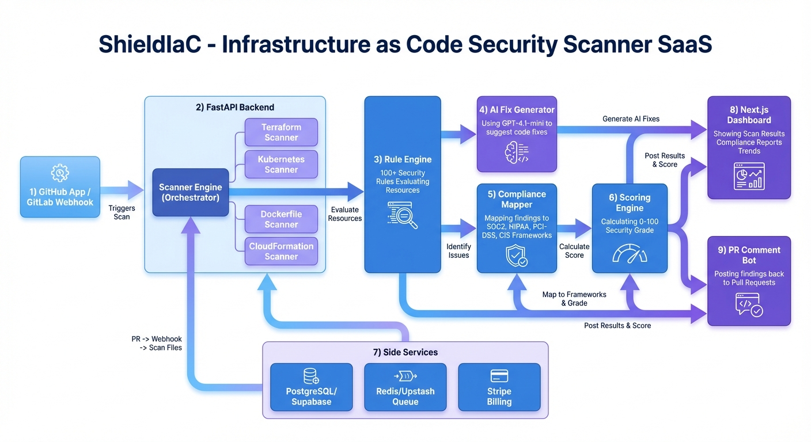

ShieldIaC is an IaC security scanning platform that processes infrastructure code through a pipeline of parsers, rule engines, AI generators, and compliance mappers to produce actionable security findings.

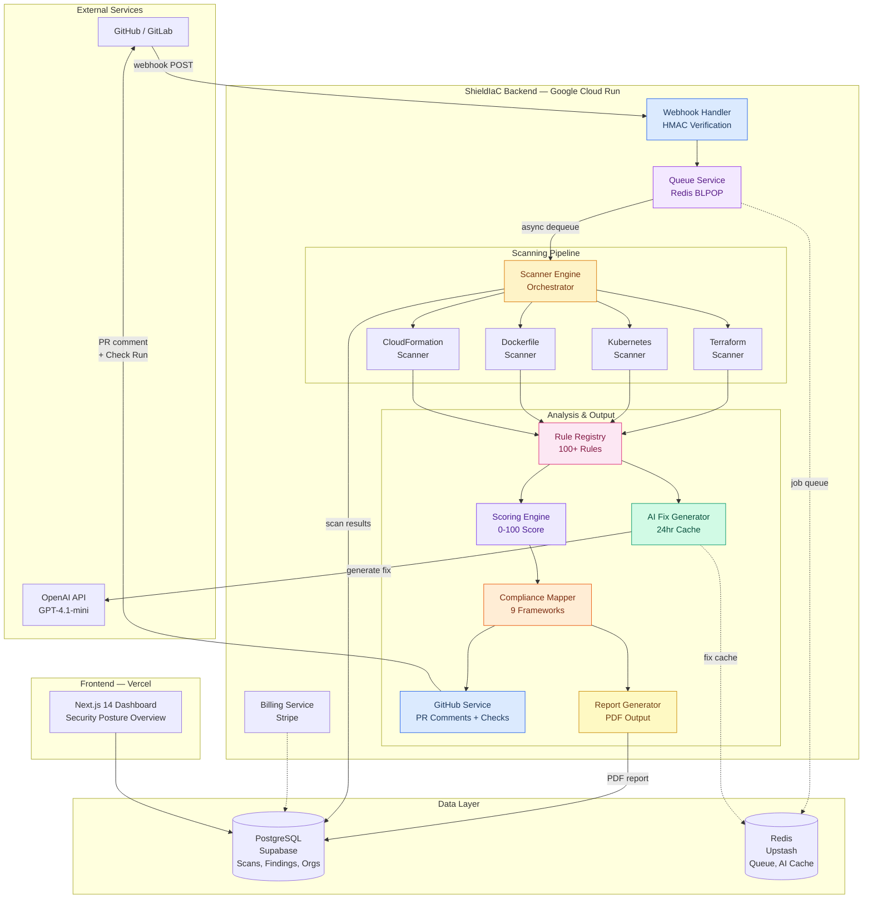

---

## Scanning Pipeline — Detailed Flow

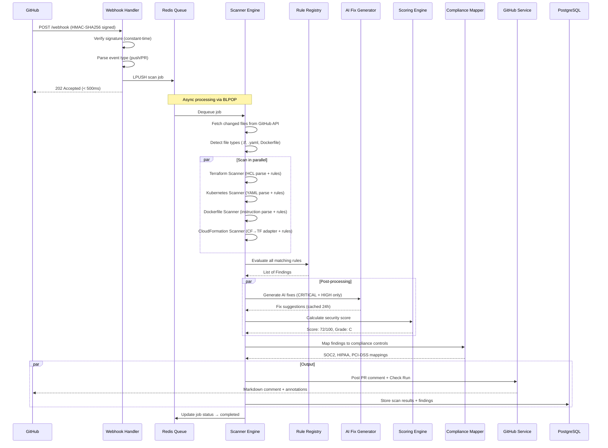

---

## Rule Engine Architecture

The rule system uses a **Registry Pattern** with auto-registration for zero-config extensibility.

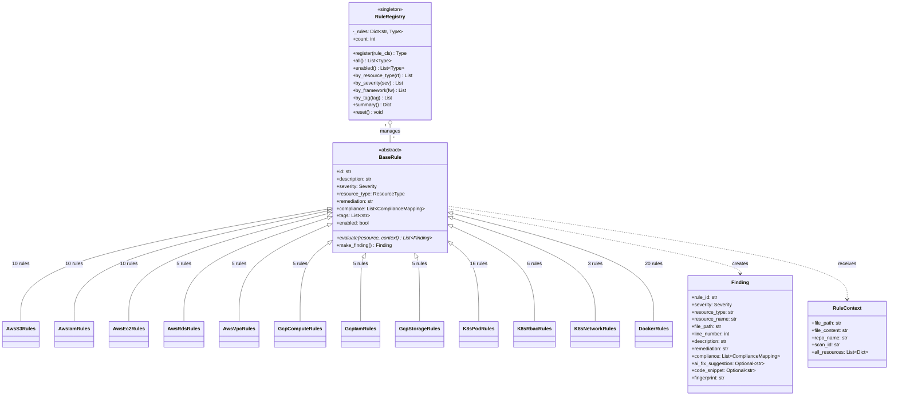

### Rule Loading Flow

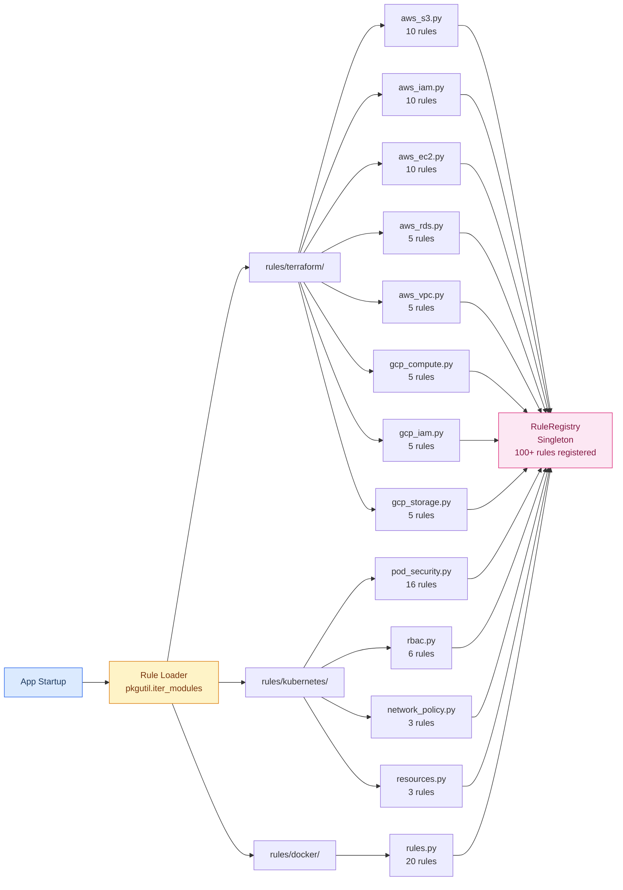

---

## Scoring Engine

Converts raw findings into a normalized 0-100 security score with letter grades.

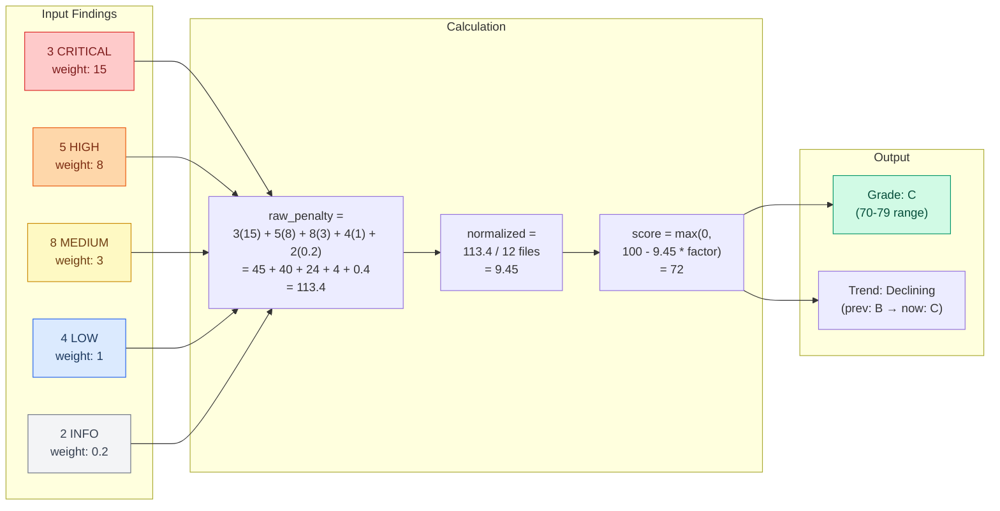

### Grade Scale

| Grade | Score Range | Meaning |
|-------|-----------|---------|
| **A** | 90-100 | Excellent security posture |
| **B** | 80-89 | Good, minor issues only |
| **C** | 70-79 | Needs attention, medium risks present |
| **D** | 60-69 | Poor, significant risks |
| **F** | 0-59 | Critical, immediate action required |

---

## Compliance Mapping

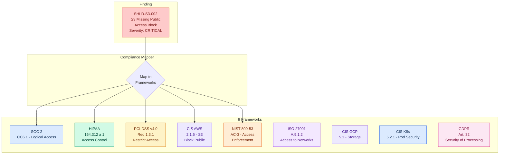

---

## AI Fix Generator

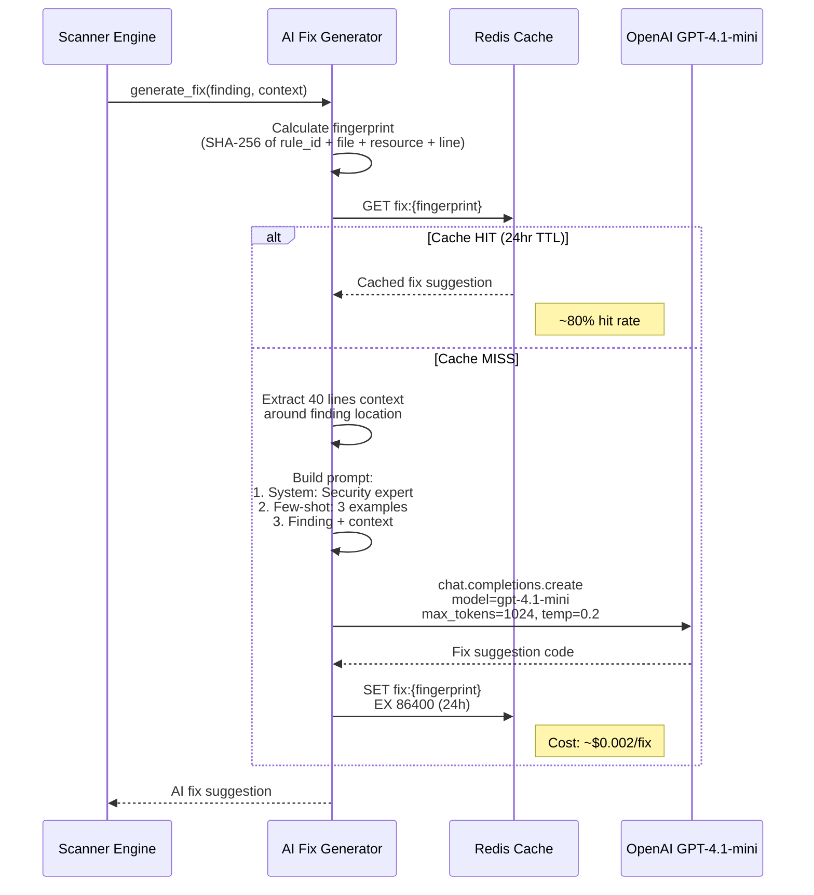

### Cost per Scan

| Component | Cost |
|-----------|------|
| Finding generation (rules) | $0.00 (local) |
| AI fix per finding | ~$0.002 |
| Average findings needing AI fix | ~3 per scan |
| Cache hit rate | ~80% |
| **Effective cost per scan** | **~$0.006** |

---

## CloudFormation Adapter

Reuses Terraform rules for CloudFormation via type and property translation.

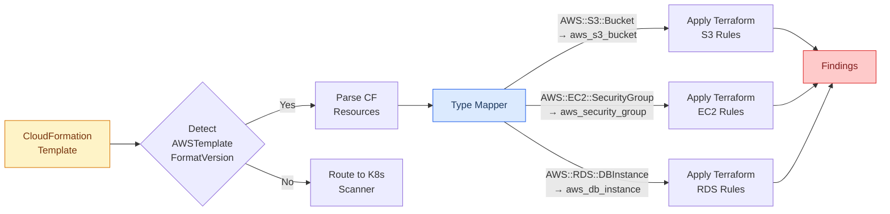

---

## Deployment Architecture

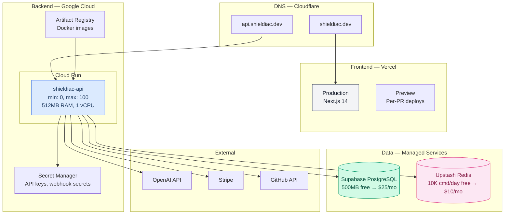

### Infrastructure Costs

| Component | Free Tier | Production | Notes |
|-----------|-----------|------------|-------|
| Cloud Run | 2M req/mo | ~$5-25/mo | Scales to zero |
| Supabase | 500MB DB | $25/mo | PostgreSQL + Auth |
| Upstash Redis | 10K cmd/day | $10/mo | Serverless Redis |
| OpenAI API | -- | ~$3-30/mo | GPT-4.1-mini @ $0.002/fix |
| Vercel | 100GB BW | Free tier | Next.js hosting |
| Cloudflare | Unlimited | Free | DNS + CDN |
| **Total** | **~$0/mo** | **~$45-90/mo** | |

---

## Security Architecture

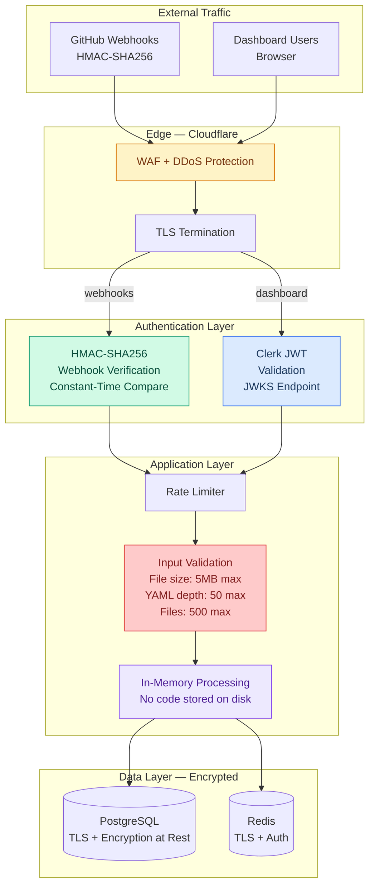

### Threat Model

| # | Threat | Impact | Mitigation |
|---|--------|--------|-----------|
| 1 | Forged webhook | Arbitrary scan injection | HMAC-SHA256 constant-time verification |
| 2 | YAML bomb / zip bomb | Denial of service | 5MB file limit, 50 depth limit, safe_load |
| 3 | Path traversal in file paths | File system access | In-memory processing only, no disk writes |
| 4 | AI prompt injection | Malicious fix suggestions | System prompt hardening, output validation |
| 5 | Code exfiltration via AI | Repo code sent to OpenAI | Only 40-line snippets, not full files |
| 6 | Multi-tenant data leak | Cross-org data access | org_id scoping on all DB queries |

---

## Data Model

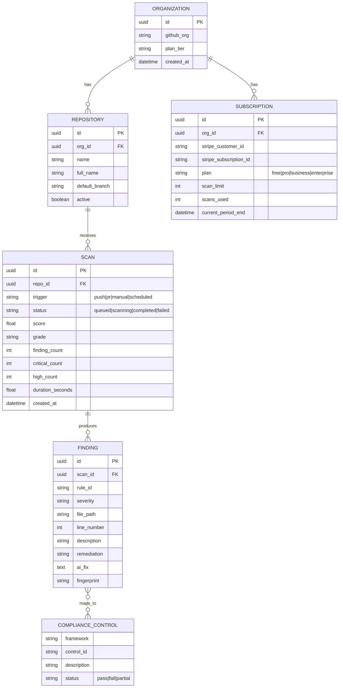

---

## Technology Stack

| Layer | Technology | Why |
|-------|-----------|-----|
| **Web Framework** | FastAPI (async Python) | Type-safe, auto-docs, native async |
| **Rule Engine** | Custom (BaseRule + Registry) | Extensible, decorator-based registration |
| **HCL Parsing** | Custom lightweight parser | No external dependency, handles 95% of configs |
| **YAML Parsing** | PyYAML (safe_load) | Industry standard, safe by default |
| **AI** | OpenAI GPT-4.1-mini | Best cost/quality ratio for code suggestions |
| **Database** | PostgreSQL (Supabase) | ACID, JSON support, managed hosting |
| **Queue** | Redis (Upstash) | BLPOP for reliable job queue, serverless |
| **PDF Reports** | ReportLab | Production-grade PDF generation |
| **Auth** | Clerk | GitHub OAuth, RBAC support |
| **Payments** | Stripe Billing | Subscription management |
| **Compute** | Google Cloud Run | Scales to zero, container-based |
| **Frontend** | Next.js 14 (Vercel) | React server components, edge deployment |

---

## Performance Targets

| Metric | Target | Notes |
|--------|--------|-------|
| Webhook response | < 500ms | Returns 202 immediately, async processing |
| Scan processing | < 30s for 100 files | Parallel rule evaluation |
| AI fix generation | < 5s per finding | Cached 24h after first generation |
| Cache hit rate (AI) | > 80% | Same finding fingerprint = same fix |
| Dashboard page load | < 2s | Static generation + client-side fetch |
| PDF report generation | < 10s | ReportLab in-memory rendering |

---

## Scaling Characteristics

| Component | Strategy | Bottleneck |
|-----------|---------|------------|
| Webhook handler | Cloud Run auto-scale (0→100) | GitHub API rate limits (5000/hr) |
| Scan workers | Redis queue + N workers | CPU for parsing large repos |
| AI fix gen | 24hr cache, rate-limited | OpenAI API rate limits |
| Database | Supabase auto-scaling | Connection pool (20+10 overflow) |
| PDF generation | Per-request on Cloud Run | Memory for large reports |

---

## Future Considerations

- **Helm chart scanning**: Parse Helm templates with value injection
- **Pulumi/CDK support**: Compile to CloudFormation, then scan
- **Custom OPA/Rego policies**: User-defined rules via Rego language
- **GitLab deep integration**: MR comments + pipeline integration
- **Self-hosted scanner**: Docker image for air-gapped environments
- **Rule marketplace**: Community-contributed rules with quality ratings
- **Scheduled scans**: Cron-based re-scanning of default branches
- **Diff-only scanning**: Only scan changed resources, not entire files

---

## Failure Modes & Resilience

ShieldIaC is designed to degrade gracefully under partial system failures rather than fail catastrophically.

### Failure Mode Matrix

| Failure Mode | Detection | Impact | Mitigation | Recovery |
|---|---|---|---|---|
| **OpenAI API failure** | HTTP 5xx / timeout | AI fix suggestions unavailable | Scan completes without AI fixes; findings still posted to PR; fix generation queued for automatic retry with exponential backoff | Retry queue processes pending fixes when API recovers; cached fixes remain available |
| **Scanner timeout (>30s)** | Watchdog timer per file | Partial scan results | Partial results returned with `scan_incomplete: true` flag; large files (>1MB) skipped with warning annotation on PR | Operator alerted; file size thresholds auto-adjusted based on p95 scan times |
| **Malicious input** | Input validation layer | Potential DoS or resource exhaustion | File size limits enforced: 1MB per file, 10MB per scan aggregate; no code execution at any stage; all parsing is sandboxed with strict depth limits (YAML: 50, HCL: 30) | Malicious payloads logged for threat intelligence; IP-level rate limiting escalation |
| **False positive storms** | Spike detection on finding counts | Alert fatigue, user trust erosion | Confidence scoring (0.0-1.0) attached to each finding; per-rule suppression via `.shieldiac.yaml`; customer feedback loop ("Mark as false positive") feeds back to tune rule thresholds | Rule auto-disabled if false positive rate exceeds 30% over 7-day window; manual review required to re-enable |
| **Queue backlog** | Queue depth monitoring | Increased scan latency | Dead letter queue (DLQ) after 3 retry attempts; backpressure signaling halts new webhook acceptance (429 response); priority lanes ensure paid tier scans processed before free tier | DLQ items reviewed daily; backlog auto-drains when workers scale up |
| **Rule engine crash** | Per-rule try/catch isolation | Missing findings for crashed rule | Individual rule failures are isolated — scan continues with remaining rules; error logged with rule_id, input hash, and stack trace | Rule automatically disabled after 5 consecutive crashes; patched rules re-enabled via config push |

### Retry Strategy

```
Attempt 1: Immediate
Attempt 2: 5s delay
Attempt 3: 30s delay
→ Dead Letter Queue (manual review)
```

### Circuit Breaker (OpenAI API)

- **Closed**: Normal operation, requests pass through
- **Open**: After 5 consecutive failures in 60s window, all AI fix requests short-circuited for 120s
- **Half-Open**: Single probe request after cooldown; success resets to Closed, failure reopens

---

## Observability & SLOs

### Service Level Objectives

| SLO | Target | SLI Measurement | Error Budget (30-day) |
|---|---|---|---|
| Scan completion latency | p95 < 10s | Histogram of `scan_duration_seconds` from scan start to results posted | 5% of scans may exceed 10s (~36 min/day at 500 scans/day) |
| AI fix generation latency | p95 < 5s | Histogram of `ai_fix_duration_seconds` per finding | 5% of fix generations may exceed 5s |
| Service uptime | 99.9% | Synthetic health checks every 60s against `/health` endpoint | 43.2 min downtime/month allowed |
| False positive rate | < 5% | `false_positive_reports / total_findings` over 7-day rolling window | Breach triggers rule review process |
| Webhook acceptance | p99 < 500ms | Histogram of webhook handler response time | 1% of webhooks may exceed 500ms |

### Error Budget Calculations

```
Monthly scan budget at 99.9% uptime:
  30 days × 24 hours × 60 minutes = 43,200 minutes
  Allowed downtime = 43,200 × 0.001 = 43.2 minutes

  If current month has consumed 30 minutes of downtime:
    Remaining budget = 43.2 - 30 = 13.2 minutes
    Budget burn rate = 30 / 43.2 = 69.4% (elevated, freeze risky deployments)
```

### Alert Thresholds

| Alert | Condition | Severity | Action |
|---|---|---|---|
| Scan latency spike | p95 > 15s for 5 min | Warning | Page on-call if sustained 15 min |
| Scan latency critical | p95 > 30s for 5 min | Critical | Auto-scale workers, page on-call |
| AI fix failure rate | > 20% failures in 10 min | Warning | Open circuit breaker, notify on-call |
| Queue depth | > 500 pending jobs | Warning | Scale workers, enable backpressure |
| Queue depth critical | > 2000 pending jobs | Critical | Reject new webhooks (429), page on-call |
| Error rate | > 5% of scans failing | Critical | Page on-call, auto-rollback if recent deploy |
| Error budget burn | > 80% monthly budget consumed | Warning | Freeze non-critical deployments |

### Key Dashboards

1. **Scan Volume Dashboard**: Scans per hour/day, breakdown by trigger type (push/PR/manual/scheduled), by org, by plan tier
2. **Rule Hit Rates**: Findings per rule over time — identifies noisy rules that may need threshold tuning or deprecation
3. **AI Fix Acceptance Rate**: Percentage of AI-generated fixes that users apply vs. dismiss — measures AI quality and ROI
4. **Compliance Coverage**: Heatmap of framework coverage (SOC2, HIPAA, PCI-DSS, etc.) across all scanned repos — identifies gaps
5. **System Health**: Worker utilization, queue depth, cache hit rates, external API latency (OpenAI, GitHub)

### Structured Logging Schema

Every scan event emits a structured JSON log entry:

```json
{
  "timestamp": "2025-01-15T10:30:00Z",
  "level": "INFO",
  "event": "scan_completed",
  "scan_id": "uuid-1234",
  "org_id": "uuid-org-5678",
  "repo_name": "acme/infrastructure",
  "trigger": "pull_request",
  "file_type": ["terraform", "dockerfile"],
  "files_scanned": 18,
  "rules_evaluated": 1800,
  "findings_count": 12,
  "critical_count": 2,
  "high_count": 4,
  "ai_fixes_generated": 3,
  "ai_fixes_cached": 2,
  "ai_fixes_failed": 0,
  "score": 72,
  "grade": "C",
  "scan_duration_ms": 4520,
  "ai_fix_duration_ms": 1200,
  "queue_wait_ms": 350
}
```

---

## Disaster Recovery & Data Protection

### RPO/RTO Targets

| Data Category | RPO (Recovery Point Objective) | RTO (Recovery Time Objective) | Backup Strategy |
|---|---|---|---|
| Scan results & findings | 1 hour | 4 hours | Supabase automatic daily backups + WAL archiving for point-in-time recovery |
| Rule configurations | 0 (version controlled) | 15 minutes | Git repository is source of truth; redeploy from main branch |
| Compliance mappings | 0 (version controlled) | 15 minutes | Embedded in codebase; deployed with application |
| AI fix cache (Redis) | 24 hours (acceptable loss) | 1 hour | Ephemeral by design; cache rebuilds organically as scans run |
| Organization & billing data | 1 hour | 4 hours | Supabase backups + Stripe as billing source of truth |

### Code Handling Policy

ShieldIaC follows a strict **zero-persistence** policy for customer source code:

- **Process in memory only**: All file content is fetched from GitHub API, parsed in memory, and discarded after scan completion
- **Never persist raw customer code**: No customer IaC files are written to disk, stored in database, or cached
- **Findings metadata only**: Only finding descriptions, file paths, line numbers, and 5-line code snippets (for AI context) are stored
- **AI context is minimal**: Only 40-line snippets around findings are sent to OpenAI, never full files or repositories
- **Ephemeral containers**: Cloud Run instances are stateless; no data survives container recycling

### Data Sovereignty

| Requirement | Implementation |
|---|---|
| EU customer data | Regional processing via Cloud Run in `europe-west1`; Supabase project in EU region |
| Data residency controls | Org-level `data_region` flag routes scans to appropriate regional workers |
| Cross-border transfers | AI fix generation uses OpenAI API (US-based); EU customers can opt out of AI fixes |
| GDPR compliance | Data deletion API for right-to-erasure; scan data auto-purged after 90 days (configurable) |
| Audit logging | All data access events logged with actor, action, resource, and timestamp |

### Backup and Recovery Procedures

1. **Automated Daily Backups**: Supabase performs daily PostgreSQL backups with 7-day retention (free tier) or 30-day retention (Pro tier)
2. **Point-in-Time Recovery**: WAL archiving enables recovery to any point within the retention window
3. **Redis Recovery**: Upstash Redis provides automatic persistence; AI fix cache is non-critical and self-heals through normal scan operations
4. **Configuration Recovery**: All application configuration is in Git; infrastructure is defined in Terraform (dogfooded); full environment rebuild takes < 30 minutes
5. **Runbook**: Disaster recovery runbook stored in `docs/runbooks/disaster-recovery.md` with step-by-step procedures and responsible contacts

---

## Capacity Planning Model

### Per-Scan Resource Consumption

```
Rules evaluated per scan:
  avg 100 rules × avg 20 files = 2,000 rule evaluations per scan

CPU time per rule evaluation:
  ~0.5ms per evaluation → 2,000 × 0.5ms = 1.0s compute per scan

AI fix generation (CRITICAL + HIGH only):
  avg 3 critical/high findings × 500ms per fix = 1.5s sequential
  Parallelized across 3 workers → ~500ms wall clock

Total scan time breakdown:
  File fetch from GitHub API:  ~1.0s
  Parsing (HCL/YAML/Docker):   ~0.5s
  Rule evaluation:              ~1.0s
  AI fix generation:            ~0.5s (parallelized, cache-assisted)
  Scoring + compliance mapping: ~0.1s
  PR comment posting:           ~0.5s
  ─────────────────────────────────────
  Total:                        ~3.6s typical (p50)
                                ~8.0s worst case (p95)
```

### Scaling Projections

| Scale | Scans/Day | Sustained RPS | Burst RPS | Workers Needed | Monthly Cost |
|---|---|---|---|---|---|
| **Startup** | 100 | 0.001 | 0.1 | 1 | ~$5 |
| **Growth** | 1,000 | 0.012 | 1 | 2 | ~$20 |
| **Scale** | 10,000 | 0.12 | 5 | 5 | ~$90 |
| **Enterprise** | 100,000 | 1.2 | 50 | 25 | ~$500 |

### OpenAI API Budget

```
At 10K scans/day:
  Scans per month:           300,000
  Avg AI fixes per scan:     3
  Total fix requests:        900,000
  Cache hit rate (~80%):     720,000 served from cache
  API calls needed:          180,000
  Cost per API call:         ~$0.002
  Monthly OpenAI cost:       180,000 × $0.002 = $360/month

  Effective cost per scan:   $360 / 300,000 = ~$0.0012/scan
  (with cache: $0.006/scan without cache → $0.0012/scan with 80% cache)
```

### Storage Growth

```
At 10K scans/day:
  Scan result size:      ~5KB per scan (findings + metadata)
  Daily storage:         10,000 × 5KB = 50MB/day
  Monthly storage:       50MB × 30 = 1.5GB/month
  Annual storage:        1.5GB × 12 = 18GB/year

  With 90-day auto-purge: max ~4.5GB steady state
```

### Queue Sizing

```
Peak burst scenario:
  Concurrent scans:      100 (monorepo push triggers many repos)
  Workers:               5
  Avg scan duration:     5s
  Worker throughput:     5 workers × (1 scan / 5s) = 1 scan/sec
  Queue drain time:      100 scans / 1 scan/sec = 100s (~1.7 min)

  At scale (25 workers):
  Worker throughput:     25 × (1/5) = 5 scans/sec
  Queue drain time:      100 / 5 = 20s

  Dead letter queue sizing: < 0.1% of scans → ~10 items/day at 10K scans/day
```
